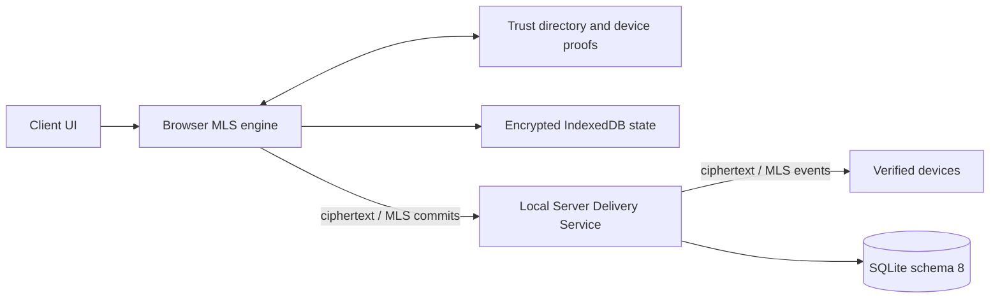

# Nexora 3.2.0 — Trust Core / MLS Development

> **Статус ветки:** experimental release development. Это не stable release и не независимо проверенная реализация E2EE. Для эксплуатации используйте `main` / Nexora 3.1.2.

Ветка добавляет Trust Core boundary и MLS 1.0 secure-message path поверх Nexora 3.1.2. Цель — исключить plaintext текста защищённого сообщения из Local Server transport/storage path и не допустить скрытого downgrade на legacy plaintext API.

## Реализовано

- безопасная migration Local Server к SQLite schema 8 с backup, free-space и integrity checks;
- Ed25519 device identity, signed verification и revocation;
- one-time MLS KeyPackage и conversation-scoped Welcome delivery;
- monotonic MLS group epochs, signed commits и replay protection;
- ciphertext-only Socket.IO transport, persistence и durable outbox;
- encrypted IndexedDB для private MLS state, KeyPackages, decrypted cache и drafts;
- browser MLS engine на `MLS_128_DHKEMX25519_AES128GCM_SHA256_Ed25519`;
- Trust Core-backed credential authentication;
- Secure Message Pane без plaintext fallback;
- Trusted Devices UI с fingerprint, verify, revoke и self-wipe;
- server-side guards для legacy send/forward/edit/draft/scheduled/poll/bot/upload paths;
- migration, recovery, plaintext-guard, functional-clock и Alice/Bob interoperability tests.

## Архитектурная граница



Local Server управляет authentication, membership, delivery order, room access, epoch/replay state и ciphertext persistence. Он не получает private MLS state и не расшифровывает secure-message content.

## Безопасный отказ

В secure pane сейчас отключены attachments, images и voice. Они не отправляются через незашифрованный legacy upload как временный обход. Потерянное или повреждённое локальное MLS-состояние также приводит к явной ошибке, а не к plaintext downgrade.

## Оставшиеся release blockers

- encrypted attachments/images/voice и authenticated metadata format;
- metadata minimization и traffic-analysis review;
- расширенная multi-device concurrency/revoke/re-add/corruption matrix;
- runtime E2E на Electron, PWA и Android, а не только production/source build;
- load/soak и long-offline recovery;
- финальная версия, changelog, release notes и operator/tester verification;
- signing-machine release checks;
- независимый cryptographic/application-security review.

## Stable baseline

Stable-линия — Nexora 3.1.2:

- API v3;
- Local Server schema 7;
- Windows, PWA и Android clients;
- Pulse Cloud/Cloud Identity 3.1.x;
- без E2EE от оператора Local Server.

Security claims этой ветки нельзя переносить в stable documentation до закрытия release blockers, полного gate и отдельного релиза.

## Документация

- [Branch status](BRANCH_STATUS.md)
- [Trust Core / MLS architecture and readiness](docs/TRUST_CORE_3.2.0.md)
- [Stable administrator guide](ADMIN_GUIDE.md)
- [Stable tester guide](TESTER_GUIDE.md)
- [Security policy](SECURITY.md)
- [Contributing](CONTRIBUTING.md)

## Проверки разработки

```bash
npm ci
npm run release:check
gradle -p android :app:assembleDebug --no-daemon
```

CI выполняет Windows syntax/build/unit/security gate, Linux full test suite и Android source build.

## Лицензия

Код и документация распространяются по лицензии [MIT](LICENSE).
