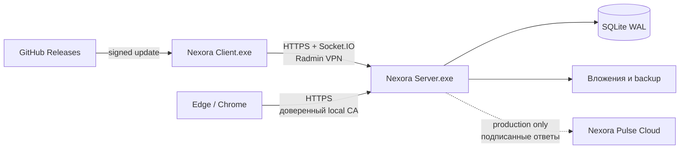

# Nexora 2.0.0

[](https://github.com/Onmaynec/Nexora/actions/workflows/ci.yml)


Nexora — самостоятельный мессенджер для Windows 10/11 и закрытой сети Radmin VPN. В комплект входят отдельные **Nexora Server**, **Nexora Client** и веб-клиент. Интерфейс использует визуальную систему Violet Grid: чёрно-фиолетовые поверхности, мягкое свечение и интерактивный фон с частицами.

Версия 2.0.0 объединяет надёжное SQLite-хранилище, полноценные личные чаты и комнаты, медиа, модерацию, защищённое подключение к локальному серверу, Nexora Plus/Pulse и автоматические обновления Client через GitHub Releases.

> Голосовые/видеозвонки и сквозное шифрование сообщений намеренно не входят в продукт по решению владельца проекта. Голосовые **сообщения** поддерживаются.

## Что умеет Nexora

| Область | Возможности |
|---|---|
| Общение | личные чаты, «Сохранённые сообщения», публичные/приватные комнаты, typing/presence, доставка и прочтение |
| Сообщения | ответы с переходом к оригиналу, редактирование/удаление, реакции, пересылка, закрепление, закладки, multi-select и копирование |
| Поиск | FTS5-поиск по всем доступным сообщениям, поиск внутри чата, поиск пользователей |
| Организация | черновик на каждый чат, закрепление, mute, архив, фильтры, непрочитанный разделитель, переход к последнему |
| Профили | кликабельные аватары, профиль как в современных мессенджерах, bio/status, аватар, цвет, Plus-рамка, контакты/блокировка |
| Медиа | файлы до 25 МБ, multi-upload, drag-and-drop, прогресс/отмена/повтор, изображения, документы, галерея |
| Голосовые | до 5 минут, pause/resume, предпрослушивание, waveform, 1×/1.5×/2×, продолжение между чатами, признак прослушивания |
| Комнаты | роли, передача владения, бан/удаление, read-only, slow mode, ограничения файлов/голосовых, заявки и приглашения с лимитами |
| Надёжность | SQLite schema 5, WAL/FULL, атомарные транзакции, миграция `nexora.json`, integrity check, retention, квоты, cleanup |
| Восстановление | автоматические/ручные копии, AES-256-GCM зашифрованные копии, страховочная копия перед restore |
| Безопасность | Secure/HttpOnly/SameSite cookie, CSRF + Origin, постоянные rate limits, login lock, аудит входа, certificate pinning |
| Windows | отдельные NSIS-установщики, Windows notifications, журналы, Client auto-update через GitHub Releases |
| Nexora Plus | подписанные entitlement, 400 импульсов/месяц, премиальные профили/реакции, коллективные цели комнат |

## Архитектура



Server является владельцем локальных аккаунтов, комнат, сообщений и файлов. Pulse Cloud — отдельный денежный контур и единственный источник истины для реальной подписки/баланса. Локальный Server принимает entitlement только после проверки Ed25519-подписи.

## Быстрый старт через Radmin VPN

1. Установите Radmin VPN на компьютер владельца и тестеров, подключите их к одной VPN-сети.
2. На компьютере владельца установите и запустите `Nexora-Server-Setup-2.0.0.exe`.
3. В Server скопируйте полный адрес с отметкой **RADMIN VPN**, например `https://26.4.1.76:3443`, а также SHA-256 сертификата.
4. Тестер устанавливает `Nexora-Client-Setup-2.0.0.exe`, вставляет адрес, сверяет отпечаток и подтверждает новый сервер.
5. Первый зарегистрированный аккаунт получает роль администратора сервера. Остальные участники VPN могут регистрироваться самостоятельно.

Для Client устанавливать `.crt` не нужно: приложение закрепляет подтверждённый сертификат за Server ID. Для Edge/Chrome корневой `.crt` нужно экспортировать из Server и добавить в «Доверенные корневые центры сертификации» Windows. Это также необходимо для микрофона в браузере.

Подробности: [руководство администратора](ADMIN_GUIDE.md) и [чек-лист тестера](TESTER_GUIDE.md).

## Сборка из исходников

Требования: Windows 10/11 x64, Node.js 22.16+ и npm. Python, Visual Studio Build Tools и `node-gyp` проекту не нужны.

```bat
git clone https://github.com/Onmaynec/Nexora.git
cd Nexora
npm ci
npm run release:check
npm run audit:security
npm run dist:windows
```

Неподписанные тестовые установщики появятся в:

- `release\client\Nexora-Client-Setup-2.0.0.exe`;
- `release\server\Nexora-Server-Setup-2.0.0.exe`.

Для публичного релиза установщики должны быть подписаны. Команда `npm run release:windows` проверяет наличие `CSC_LINK` и `CSC_KEY_PASSWORD` и останавливается, если секретов нет.

## Проверки качества

```bat
npm run check
npm test
npm run audit:security
set NEXORA_SOAK_MINUTES=60
npm run test:soak
```

В 2.0.0 входит 42 автоматических теста. Они покрывают сеть Radmin/LAN, HTTPS и certificate pinning, SQLite schema 5 и миграции, аварийное завершение во время записи, backup/restore, комнаты/медиа/голосовые, очередь отправки, Pulse, UI-регрессии из тестовых скриншотов, соответствие release-тега версии и нагрузку 20 клиентов / 120 сообщений.

## Автообновление Client через GitHub

Упакованный Client проверяет публичные стабильные Releases репозитория `Onmaynec/Nexora`, автоматически скачивает новую версию и устанавливает её при выходе. Workflow [`.github/workflows/release.yml`](.github/workflows/release.yml) запускается тегом `v*`, собирает подписанные Windows-артефакты, публикует Client вместе с `latest.yml`/blockmap и добавляет Server + SHA-256 в Release.

Публичный репозиторий: [`Onmaynec/Nexora`](https://github.com/Onmaynec/Nexora). Для каждого стабильного обновления нужно:

1. сохранить GitHub Secrets `WINDOWS_CERTIFICATE_BASE64` и `WINDOWS_CERTIFICATE_PASSWORD`;
2. обновить версию в `package.json` и release notes;
3. отправить в `main` commit с префиксом `release:` либо вручную отправить соответствующий аннотированный тег.

После успешного CI release-коммита workflow сам создаёт аннотированный тег вида `v2.0.0`. Он отклоняет тег, не совпадающий с `package.json`, и только после полной проверки публикует Release с Client `.exe`, `.blockmap`, `latest.yml`, Server `.exe` и `SHA256SUMS.txt`.

Server обновляется управляемо администратором через отдельный HTTPS feed. Подробности: [GitHub Release Guide](docs/GITHUB_RELEASE.md).

## Nexora Plus и Pulse

Режимы задаются на Server:

- `disabled` — коммерческие возможности скрыты/недоступны;
- `sandbox` — тестовая Plus-активация без денег;
- `production` — checkout и баланс только через Pulse Cloud.

Production требует `NEXORA_PULSE_CLOUD_URL`, `NEXORA_PULSE_API_KEY` и `NEXORA_PULSE_PUBLIC_KEY`. Реальные платежи не активируются локальным флагом и требуют отдельного платёжного провайдера, юридических текстов, webhooks и облачного сервиса Billing. См. [архитектуру Pulse](docs/PULSE.md).

## Данные и границы безопасности

Рабочие данные Server находятся в каталоге `userData\server-data`; точный путь открывает кнопка «Открыть данные». Не копируйте активный `nexora.sqlite` вручную — используйте встроенную резервную копию.

Nexora рассчитана на закрытую LAN/Radmin VPN, а не на прямую публикацию портов в интернет. Сообщения не имеют E2EE и доступны администратору компьютера Server через рабочую базу. Полная модель угроз и остаточные риски описаны в [SECURITY.md](SECURITY.md) и [SECURITY_AUDIT.md](SECURITY_AUDIT.md).

## Документация

- [Release Notes 2.0.0](RELEASE_NOTES_2.0.0.md)
- [Отчёт верификации 2.0.0](RELEASE_VERIFICATION_2.0.0.md)
- [Changelog](CHANGELOG.md)
- [Руководство администратора](ADMIN_GUIDE.md)
- [Руководство тестера](TESTER_GUIDE.md)
- [Архитектура](docs/ARCHITECTURE.md)
- [Nexora Plus / Pulse](docs/PULSE.md)
- [GitHub Releases и подпись](docs/GITHUB_RELEASE.md)
- [Release checklist](docs/RELEASE_CHECKLIST.md)
- [Карта проекта и API](PROJECT_INDEX.md)
- [Security audit](SECURITY_AUDIT.md)
- [Как внести изменение](CONTRIBUTING.md)

## Статус релиза

Исходники 2.0.0, миграции, CI/release workflows и тестовый контур опубликованы в публичном репозитории и помечены тегом `v2.0.0`. Подписанные Windows-установщики и канал автообновления становятся доступны только после успешного release workflow с настроенным Authenticode-сертификатом. Production Pulse/платежи остаются выключенными до развёртывания отдельного Cloud и юридического контура.
