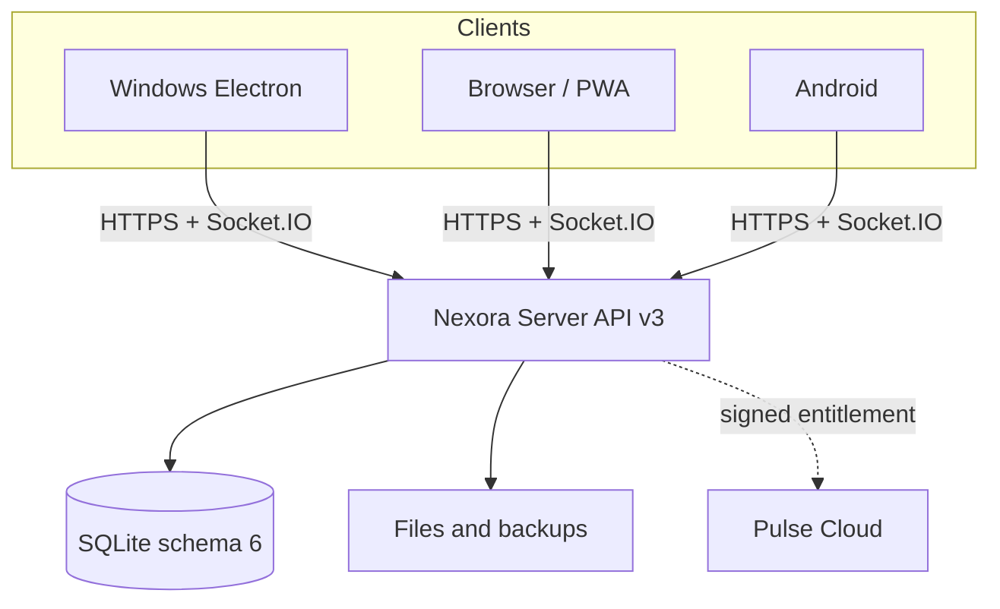

# Nexora

[](https://github.com/Onmaynec/Nexora/actions/workflows/ci.yml)


[](LICENSE)

Nexora — self-hosted мессенджер с единым интерфейсом для Windows, браузера/PWA и Android. Сервер управляет аккаунтами, сообщениями, ролями, файлами и политиками доступа; клиенты синхронизируются по HTTPS и Socket.IO и поддерживают устойчивую офлайн-очередь.

> **Текущий стабильный релиз:** `3.0.0`. Nexora не использует E2EE: оператор сервера имеет технический доступ к рабочей базе и вложениям. Перед развёртыванием ознакомьтесь с [моделью безопасности](SECURITY.md).

## Основные возможности

- личные чаты, Saved Messages, комнаты, ответы, ветки, реакции, опросы, редактирование и пересылка сообщений;
- роли владельца и модераторов, пользовательские разрешения, приглашения, заявки, баны, slow mode, read-only и аудит действий;
- IndexedDB-кэш, delta sync, durable outbox и безопасное переключение между несколькими серверами;
- загрузка файлов и изображений до 25 МБ, resumable upload, проверка фактического MIME-типа и голосовые сообщения;
- TOTP, recovery codes, CSRF/Origin-проверки, rate limits, резервное копирование и контроль целостности SQLite;
- Windows Client/Server, устанавливаемая PWA, Android WebView shell, боты, scoped API tokens и подписанные webhooks;
- Nexora Plus/Pulse в sandbox-режиме и через отдельный production trust boundary.

Полный состав релиза: [Release Notes 3.0.0](RELEASE_NOTES_3.0.0.md).

## Архитектура



Server является единственным authority для аккаунтов, сообщений, ролей и файлов. Клиенты хранят только ограниченный кэш и очередь исходящих операций. Production Pulse Cloud разворачивается отдельно и не доверяет локальному флагу покупки.

Подробности: [архитектура](docs/ARCHITECTURE.md) и [индекс проекта/API](PROJECT_INDEX.md).

## Требования

- Node.js `22.16+` и npm;
- Windows 10/11 для Electron-сборок;
- JDK 17 и Android SDK 36 для Android-клиента;
- HTTPS для браузерных, Android- и публичных развёртываний.

## Быстрый старт для разработки

```bash
git clone https://github.com/Onmaynec/Nexora.git
cd Nexora
npm ci
npm run dev
```

Проверка перед Pull Request:

```bash
npm run check
npm test
npm run audit:security
```

Для локальной Windows-сборки:

```bash
npm run dist:windows
```

Неподписанные локальные установщики предназначены только для тестирования. Требования к стабильному релизу и подписи описаны в [GitHub Release Guide](docs/GITHUB_RELEASE.md).

## Развёртывание

### Windows / LAN

1. Запустите Nexora Server на компьютере владельца.
2. Скопируйте HTTPS-адрес и SHA-256 fingerprint сертификата.
3. Добавьте сервер в Nexora Client и вручную сверьте fingerprint.
4. Первый зарегистрированный аккаунт получает административные полномочия сервера.

Для браузера и Android локальный CA должен быть установлен в доверенные сертификаты ОС. Клиенты не обходят TLS-ошибки.

Публичный сервер размещайте только за HTTPS reverse proxy, с ограниченным firewall, явным `allowedOrigins` и регулярными резервными копиями. Не публикуйте локальный порт напрямую в интернет.

### PWA и Android

PWA устанавливается из Chrome/Edge по HTTPS. Service worker кэширует только оболочку приложения, а пользовательские данные сохраняются в IndexedDB после авторизации.

Android source находится в [`android/`](android/README.md):

```bash
gradle -p android :app:assembleRelease
```

## Границы продукта

- сообщения и вложения не защищены E2EE от оператора сервера;
- голосовые сообщения поддерживаются, но голосовые/видеозвонки и демонстрация экрана не входят в релиз 3.0.0;
- криптовалюты и NFT не являются частью продукта;
- production-покупка Plus требует отдельного Pulse Cloud, платёжного провайдера и юридической инфраструктуры.

## Документация

| Раздел | Документ |
|---|---|
| Архитектура и карта кода | [ARCHITECTURE.md](docs/ARCHITECTURE.md), [PROJECT_INDEX.md](PROJECT_INDEX.md) |
| Администрирование | [ADMIN_GUIDE.md](ADMIN_GUIDE.md) |
| Тестирование | [TESTER_GUIDE.md](TESTER_GUIDE.md), [RELEASE_VERIFICATION_3.0.0.md](RELEASE_VERIFICATION_3.0.0.md) |
| Plus / Pulse | [PULSE.md](docs/PULSE.md) |
| Боты и интеграции | [AUTOMATIONS.md](docs/AUTOMATIONS.md) |
| Релизы | [CHANGELOG.md](CHANGELOG.md), [GITHUB_RELEASE.md](docs/GITHUB_RELEASE.md), [RELEASE_CHECKLIST.md](docs/RELEASE_CHECKLIST.md) |
| Безопасность | [SECURITY.md](SECURITY.md), [SECURITY_AUDIT.md](SECURITY_AUDIT.md) |

## Участие в проекте

Перед изменениями прочитайте [CONTRIBUTING.md](CONTRIBUTING.md) и [CODE_OF_CONDUCT.md](CODE_OF_CONDUCT.md).

- ошибки: [Bug report](https://github.com/Onmaynec/Nexora/issues/new?template=bug_report.yml);
- предложения: [Feature request](https://github.com/Onmaynec/Nexora/issues/new?template=feature_request.yml);
- вопросы по установке и эксплуатации: [SUPPORT.md](SUPPORT.md);
- уязвимости: только приватно по инструкции в [SECURITY.md](SECURITY.md).

## Лицензия

Код и документация распространяются по лицензии [MIT](LICENSE).