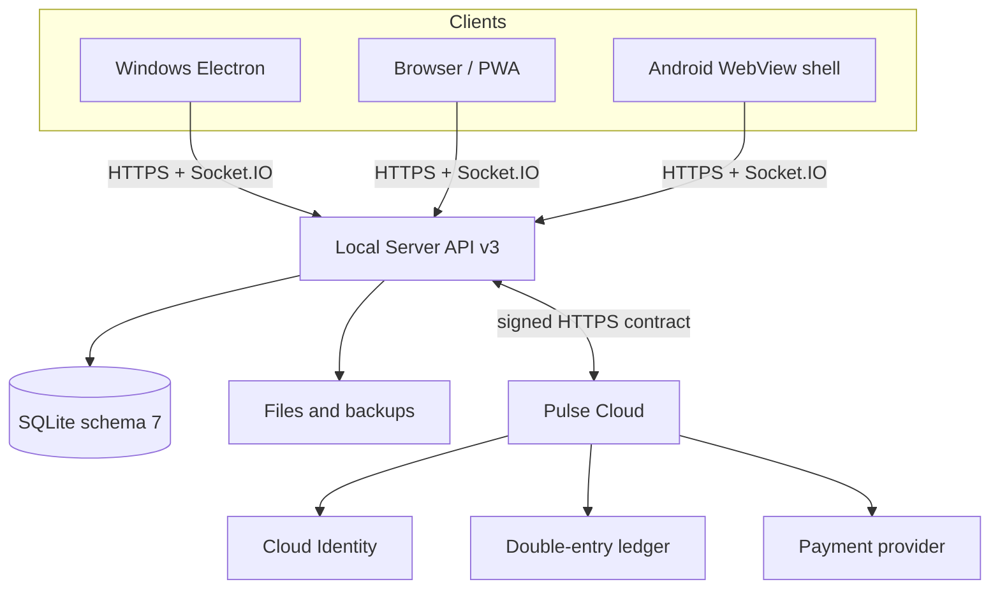

# Nexora

[](https://github.com/Onmaynec/Nexora/actions/workflows/ci.yml)


[](LICENSE)

Nexora — self-hosted мессенджер с единым интерфейсом для Windows, браузера/PWA и Android. Local Server управляет локальными аккаунтами, сообщениями, комнатами, ролями, файлами и политиками доступа. Pulse Cloud вынесен в отдельную доверенную границу и отвечает только за Cloud Identity, billing, ledger и production-entitlements.

> **Текущая стабильная версия:** `3.1.2`. В stable-линейке 3.1.x сообщения и вложения не защищены E2EE от оператора Local Server. Экспериментальная работа над Trust Core/MLS ведётся отдельно и не должна восприниматься как свойство текущего релиза.

## Возможности

### Общение и комнаты

- личные чаты, Saved Messages, комнаты, ответы, ветки, реакции, опросы, упоминания, редактирование и пересылка;
- offline cache, delta sync, durable outbox, серверные черновики, silent и scheduled send;
- роли owner/moderator/member, custom roles, приглашения, заявки, баны, read-only, slow mode, ограничения файлов/голосовых и room audit;
- resumable upload, проверка фактического MIME-типа, изображения, PDF/text preview и голосовые сообщения.

### Безопасность и эксплуатация

- HTTPS, certificate fingerprint pinning, отдельная Electron session для каждого Server ID;
- HttpOnly session cookie, Origin/CSRF-проверки, rate limits, TOTP и одноразовые recovery codes;
- SQLite schema 7 с pre-migration backup, integrity checks, WAL/FULL, backup/restore, quota и retention;
- liveness/readiness, защищённые Prometheus metrics, request IDs, credential redaction и graceful drain;
- фиксированный audited developer-command registry без shell/eval.

### Nexora Plus / Pulse

- Cloud Identity с подтверждением email, TOTP MFA и OAuth 2.1 Authorization Code + PKCE;
- signed Local Account ↔ Cloud Account linking и Ed25519-подписанные entitlement/event envelopes;
- Nexora Plus, Impulse ledger, receipts, room goals, billing portal и cancel-at-period-end;
- Local Server sandbox для разработки и демонстрации без реальных платежей и production-подписей;
- production billing только через отдельный Pulse Cloud и платёжного провайдера.

Полный состав релизов: [3.1.0](RELEASE_NOTES_3.1.0.md), [3.1.1](docs/PRODUCTION_HARDENING_3.1.1.md) и [3.1.2](RELEASE_NOTES_3.1.2.md).

## Архитектура



Local Server остаётся единственным authority локального контента и прав доступа. Pulse Cloud не получает сообщения, комнаты, вложения, локальные пароли или приватные ключи локального CA. Подробности: [архитектура](docs/ARCHITECTURE.md), [индекс проекта/API](PROJECT_INDEX.md) и [Pulse trust boundary](docs/PULSE.md).

## Требования

- Node.js `22.16+` и npm;
- Windows 10/11 для Electron Client/Server;
- JDK 17, Android SDK 36 и Gradle 8.13 для Android source build;
- HTTPS для PWA, Android и публичных развёртываний;
- отдельная Cloud-среда и provider credentials только при использовании production Pulse.

## Быстрый старт для разработки

```bash
git clone https://github.com/Onmaynec/Nexora.git
cd Nexora
npm ci
npm run dev
```

Проверка перед Pull Request:

```bash
npm run check
npm test
npm run audit:security
```

Локальная Windows-сборка:

```bash
npm run dist:windows
```

Неподписанные локальные установщики предназначены только для тестирования. Stable updater принимает только корректно подписанный NSIS release с `latest.yml` и blockmap.

## Развёртывание Local Server

1. Запустите Nexora Server на компьютере владельца.
2. Скопируйте полный HTTPS-адрес, Server ID и SHA-256 fingerprint.
3. На Electron Client вручную подтвердите fingerprint нового сервера.
4. Для браузера/PWA и Android установите локальный CA в доверенное хранилище ОС.
5. Первый зарегистрированный локальный аккаунт получает административные полномочия Server.

Публичный Local Server размещайте только за HTTPS reverse proxy, с ограниченным firewall, явным `allowedOrigins`, резервными копиями и мониторингом. Не публикуйте локальный порт напрямую в интернет.

## Обновления 3.1.2

- global voice dock полностью очищает audio state и сразу размонтируется после закрытия;
- Electron updater выполняет initial check, использует single-flight и повторяет проверку каждые шесть часов;
- отсутствие installable signed metadata возвращает стабильную диагностическую причину;
- Local Pulse sandbox управляется через audited CLI/Windows Server Admin команды;
- sandbox checkout отключён, balance не может стать отрицательным, а production Pulse автоматически блокирует локальную выдачу.

## Границы продукта

- stable 3.1.2 не предоставляет E2EE;
- голосовые сообщения поддерживаются, но голосовые/видеозвонки и демонстрация экрана не входят в stable 3.1.2;
- криптовалюты и NFT не являются частью продукта;
- production-покупки требуют отдельного Pulse Cloud, provider integration и юридической инфраструктуры;
- автоматические проверки не заменяют внешний pentest, supply-chain review и эксплуатационный мониторинг.

## Документация

| Раздел | Документ |
|---|---|
| Архитектура и карта кода | [ARCHITECTURE.md](docs/ARCHITECTURE.md), [PROJECT_INDEX.md](PROJECT_INDEX.md) |
| Администрирование | [ADMIN_GUIDE.md](ADMIN_GUIDE.md) |
| Тестирование и верификация | [TESTER_GUIDE.md](TESTER_GUIDE.md), [RELEASE_VERIFICATION_3.1.2.md](RELEASE_VERIFICATION_3.1.2.md) |
| Plus / Pulse | [PULSE.md](docs/PULSE.md), [RELEASE_3.1.0.md](docs/RELEASE_3.1.0.md) |
| Production hardening | [PRODUCTION_HARDENING_3.1.1.md](docs/PRODUCTION_HARDENING_3.1.1.md) |
| Исправления 3.1.2 | [BUGFIX_3.1.2.md](docs/BUGFIX_3.1.2.md) |
| Боты и интеграции | [AUTOMATIONS.md](docs/AUTOMATIONS.md) |
| Релизы | [CHANGELOG.md](CHANGELOG.md), [GITHUB_RELEASE.md](docs/GITHUB_RELEASE.md), [RELEASE_CHECKLIST.md](docs/RELEASE_CHECKLIST.md) |
| Безопасность | [SECURITY.md](SECURITY.md), [SECURITY_AUDIT.md](SECURITY_AUDIT.md) |

## Участие в проекте

Перед изменениями прочитайте [CONTRIBUTING.md](CONTRIBUTING.md) и [CODE_OF_CONDUCT.md](CODE_OF_CONDUCT.md).

- ошибки: [Bug report](https://github.com/Onmaynec/Nexora/issues/new?template=bug_report.yml);
- предложения: [Feature request](https://github.com/Onmaynec/Nexora/issues/new?template=feature_request.yml);
- вопросы по установке и эксплуатации: [SUPPORT.md](SUPPORT.md);
- уязвимости: только приватно по инструкции в [SECURITY.md](SECURITY.md).

## Лицензия

Код и документация распространяются по лицензии [MIT](LICENSE).
