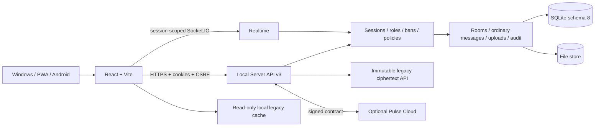

# Nexora

[](https://onmaynec.github.io/Nexora/)
[](https://github.com/Onmaynec/Nexora/actions/workflows/ci.yml)


[](LICENSE)

**Nexora** is a self-hosted messaging platform for Windows, browser/PWA and Android. It combines a Local Server, rooms and moderation, ordinary server-readable messaging, voice/media, offline synchronization, operations tooling and the optional Nexora Pulse commercial boundary.

> **Stable Core release candidate:** version `3.4.0` is implemented in PR #69 but is not published. Stable publication is blocked until a verified stable `v3.3.4` baseline exists, Authenticode/Windows acceptance is complete and an independent security review closes all high/critical findings.

## Product status

| Line | Purpose | Distribution status |
|---|---|---|
| `3.4.0` | Stable Core: ordinary messaging, immutable legacy history, devices/sessions, backup verification and signed updater | Release candidate; not merged/tagged/published |
| `3.3.3` | Goals, voice UX, Pulse purchase effects and MLS recovery | Published `UNSIGNED-TEST` prerelease without updater metadata |
| `3.1.2` | Messaging and Pulse production hardening | Last confirmed signed production baseline |

Authoritative 3.4.0 documents:

- [Release Notes 3.4.0](RELEASE_NOTES_3.4.0.md)
- [Release Verification 3.4.0](RELEASE_VERIFICATION_3.4.0.md)
- [Security Review 3.4.0](SECURITY_REVIEW_3.4.0.md)
- [Project Index](PROJECT_INDEX.md)
- [Documentation Portal](docs/README.md)

## Stable Core

### Ordinary messaging

- personal dialogs, Saved Messages and rooms;
- replies, threads, reactions, mentions, polls and bookmarks;
- edit/delete/forward/pin and scheduled/silent send;
- ordinary files, images and voice messages;
- IndexedDB cache, delta sync and bounded durable outbox;
- server-side authorization for REST and Socket.IO.

Ordinary chats connect using the current server session and no longer depend on Trust enrollment, MLS epoch synchronization or Welcome recovery.

### Legacy Trust/MLS history

Executable Trust Core, recovery routes, MLS transport, encrypted-upload write runtime, client MLS engine and the `ts-mls` dependency are removed.

Schema 8 remains as a compatibility layer so legacy IDs, timestamps, epochs, ciphertext and audit provenance are not lost.

- legacy conversations open in a dedicated read-only viewer;
- the server never decrypts or converts ciphertext into plaintext;
- pre-existing locally decrypted IndexedDB records may be read through readonly transactions;
- export combines immutable server evidence and available local content on the client;
- all legacy HTTP writes return `410/LEGACY_READ_ONLY`;
- `mls:message` and `mls:message-edit` are rejected with the same stable code.

### Sessions and devices

The Local Server builds a device inventory from active sessions with device ID, name, platform, client version, creation, last-seen and expiry.

- revoke one remote device;
- revoke all except current;
- immediate `session.revoked` event and Socket.IO disconnect;
- `device.updated` inventory refresh;
- current-device remote revoke is rejected with `STATE_CONFLICT`; logout is explicit.

Electron isolates cookies, IndexedDB, cache and certificate pinning by Server ID. Certificate/identity changes require explicit confirmation; silent repin is prohibited.

### Rooms and administration

- roles `owner`, `moderator`, `member` and existing custom roles;
- atomic ownership transfer and moderator management;
- remove, ban/unban and ban list;
- join requests and invitations with expiration/usage limits/revocation;
- read-only, slow mode, announcement and pre-approval;
- restrictions for files, images and voice;
- administrative audit and system messages;
- active-ban fail-closed authorization.

### Backup and migration

- SQLite WAL/FULL with integrity checks;
- schema 8 migration checks source integrity, WAL checkpoint, free space and verified backup before transaction;
- migration is transactional/idempotent and future schemas are blocked;
- backup verification is available without restore;
- restore stages DB and file store separately and rolls both back on failure;
- temporary decrypted/staged data is cleaned on success and failure;
- graceful shutdown is serialized and bounded.

### Stable errors and diagnostics

Errors use a stable safe envelope:

```json
{
  "ok": false,
  "code": "STATE_CONFLICT",
  "message": "Safe user-facing message",
  "requestId": "correlation-id",
  "details": {}
}
```

The compatibility `error` field mirrors the safe message. Stack traces, SQL, filesystem paths, tokens, keys and provider secrets are not returned.

### Signed updater and release chain

Windows Client uses the `latest` metadata channel; Windows Server uses `server`.

- signature verification is mandatory;
- custom feeds must use HTTPS;
- prerelease/downgrade states are rejected;
- signature/checksum failures map to `UPDATE_SIGNATURE_INVALID`;
- stable signing requires expected certificate subject, thumbprint and timestamp;
- the workflow verifies a signed `3.3.4 → 3.4.0` installed upgrade;
- source, PWA, Client, Server, Android evidence, SPDX SBOM and SHA-256 assets are re-downloaded and verified.

Without complete signing policy, only a distinct `v3.4.0-unsigned-test.<run>` prerelease is allowed and updater metadata/blockmaps are forbidden.

## Architecture



Detailed architecture: [docs/ARCHITECTURE.md](docs/ARCHITECTURE.md).

## Quick start for development

Requirements:

- Node.js `22.16+`;
- npm;
- Java 17 and Gradle 8.13 for Android;
- Windows signing environment only for signed production packages.

```bash
npm ci
npm run dev
```

Local Server only:

```bash
npm run dev:server
```

Web client only:

```bash
npm run dev:web
```

Production web build:

```bash
npm run build:web
```

## Verification

```bash
npm run check
npm run test:unit
npm run test:performance
npm run audit:security
npm run release:consistency
npm run release:check
npm run test:soak
gradle -p android :app:assembleDebug --no-daemon
```

Signed Windows packages require protected credentials:

```bash
npm run release:windows:signed
```

The official release workflow additionally verifies baseline `v3.3.4`, Authenticode identity/timestamp, installed n-1→n upgrade, immutable tag/assets and post-publication hashes.

## API additions in 3.4.0

### Devices

- `GET /api/v3/devices`
- `DELETE /api/v3/devices/:deviceId/sessions`
- `DELETE /api/v3/devices/sessions/others`

Realtime: `session.revoked`, `device.updated`.

### Legacy history

- `GET /api/v3/legacy-secure/conversations`
- `GET /api/v3/legacy-secure/conversations/:conversationId/messages`
- `POST /api/v3/legacy-secure/conversations/:conversationId/export`

Realtime state: `legacy_secure_history.state`.

### Operations

- `POST /api/v3/admin/backups/verify`
- `GET /api/admin/release/signing-status`

## Security boundary

The Local Server is authoritative for ordinary messages, sessions, rooms, roles, bans, upload policy, audit and realtime visibility. Every mutation validates authentication, Origin/CSRF, resource scope, membership/permission, ban/policy, input and resource limits before side effects.

See [Security Model](docs/SECURITY_MODEL.md) and [Security Policy](SECURITY.md).

## Documentation

- [Documentation Portal](docs/README.md)
- [Project Index](PROJECT_INDEX.md)
- [Architecture](docs/ARCHITECTURE.md)
- [Security Model](docs/SECURITY_MODEL.md)
- [Deployment](docs/DEPLOYMENT.md)
- [Operations Runbook](docs/OPERATIONS_RUNBOOK.md)
- [Administrator Guide](ADMIN_GUIDE.md)
- [Tester Guide](TESTER_GUIDE.md)
- [Release Policy](docs/RELEASE_POLICY.md)
- [Release Checklist](docs/RELEASE_CHECKLIST.md)

## Release blockers

PR #69 must remain draft and no official `v3.4.0` tag/release may be created while any item remains:

1. verified published stable `v3.3.4` is absent;
2. CI/release gates are not green on the final commit;
3. Authenticode credentials and Windows 10/11 installed acceptance are unavailable;
4. independent security review is pending;
5. PR review, merge, post-merge CI and immutable release evidence are incomplete.

## License

[MIT](LICENSE)
