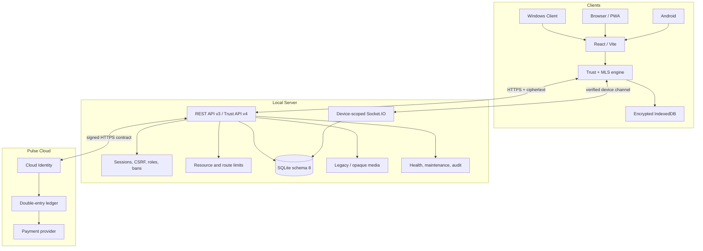

# Nexora

[](https://onmaynec.github.io/Nexora/)
[](https://github.com/Onmaynec/Nexora/actions/workflows/ci.yml)


[](LICENSE)

**Nexora** — self-hosted платформа обмена сообщениями для Windows, браузера/PWA и Android. Система объединяет локальный сервер, многоплатформенный клиент, комнаты и модерацию, офлайн-синхронизацию, защищённые сообщения и медиа, эксплуатационные инструменты, а также отдельный коммерческий контур Nexora Pulse.

**Сайт проекта:** [onmaynec.github.io/Nexora](https://onmaynec.github.io/Nexora/) — интерактивная презентация, архитектурные схемы, актуальные GitHub-метрики, документация и загрузки по версиям.

## Статус продукта

| Линия | Назначение | Статус распространения |
|---|---|---|
| `3.2.5` | Плавная отправка сообщений, восстановленный media UX, Pulse/SQLite fix и in-app release experience | Source/PWA prerelease для контролируемого тестирования |
| `3.1.2` | Основной messaging-контур, Pulse Cloud и production hardening | Последняя подтверждённая signed production baseline |

`3.2.5` проходит автоматические build-, unit-, API-, integration-, performance-, security-, soak- и Android source-gates. Она не является подписанным стабильным Windows-релизом и не заявляется как независимо аудированная E2EE-система. Авторитетные документы текущей линии:

- [Release Notes 3.2.5](RELEASE_NOTES_3.2.5.md);
- [Security Review 3.2.5](SECURITY_REVIEW_3.2.5.md);
- [Release Verification 3.2.5](RELEASE_VERIFICATION_3.2.5.md).

## Возможности

### Общение и совместная работа

- личные диалоги, Saved Messages и комнаты;
- ответы, ветки, реакции, упоминания и опросы;
- редактирование, удаление, пересылка, закрепление и закладки;
- silent и scheduled send, серверные черновики и история изменений;
- глобальный поиск, уведомления, архивирование и фильтры;
- IndexedDB cache, delta sync и durable outbox для восстановления после потери связи.

### Комнаты и администрирование

- роли `owner`, `moderator`, `member` и custom roles;
- атомарная передача владения и управление модераторами;
- удаление участника, бан, разбан и room ban list;
- заявки на вступление и несколько приглашений;
- срок действия, лимит использований и отзыв приглашений;
- read-only, slow mode, announcement и pre-approval;
- ограничения файлов, изображений и голосовых;
- административный журнал и системные сообщения;
- server-side authorization для REST и realtime-операций.

### Файлы, изображения и голосовые

Для обычных диалогов доступны resumable uploads с проверкой размера, SHA-256 и фактического MIME-типа, previews и voice playback.

В secure conversations:

- Client шифрует данные AES-256-GCM до загрузки;
- Local Server хранит opaque ciphertext;
- API проверяет фактический размер ciphertext и SHA-256;
- pending attachment недоступен до атомарной привязки к MLS-message;
- поддерживаются progress, cancel, idempotent retry и one-time claim;
- preview, playback и download выполняются после локальной проверки и расшифровки;
- при запрете любого класса `files/images/voice` secure-media path блокируется fail-closed.

### Trust Core и MLS

- Ed25519 device identity с proof-of-possession;
- отдельные ключи для identity proof и MLS signatures;
- строгая привязка MLS BasicCredential к `{ userId, deviceId }`;
- сравнение fingerprint, подписанное подтверждение и отзыв устройств;
- one-time KeyPackages и device/conversation-scoped Welcome delivery;
- monotonic epochs, signed commits и replay protection;
- device-scoped Socket.IO delivery только активным verified devices;
- ciphertext-only persistence и durable MLS outbox;
- encrypted IndexedDB для private MLS state, KeyPackages, decrypted cache и drafts;
- missed-commit recovery с проверкой scope, последовательности epoch, hashes и public-state chain;
- server-side guards против plaintext downgrade через legacy send/edit/forward/draft/scheduled/poll/bot/upload paths.

Фиксированный MLS profile: `MLS_128_DHKEMX25519_AES128GCM_SHA256_Ed25519`.

### Patch release 3.2.5

- окно обновления внутри приложения, русские release notes и сохранённый signed-update gate;
- быстрый encrypted outbox без полного reload истории после каждого сообщения;
- исправленные Plus/Impulse команды с real-SQLite regression-тестом;
- inline preview изображений и waveform-плеер голосовых после локальной расшифровки;
- фоновое MLS Welcome recovery для гонки создания группы без plaintext downgrade;
- memoized message rows, условная автопрокрутка и стабильный composer;
- интерактивная сеть только внутри истории чата;
- отдельные local и signed Windows build-команды.

### Security hardening 3.2.3

- не более 16 активных Trust devices на локальную учётную запись;
- не более 25 KeyPackages в одном запросе, 32 unclaimed packages на устройство и 256 на пользователя;
- атомарное применение лимитов в SQLite;
- bounded route-specific rate limits для Trust, recovery и E2EE upload routes;
- стабильная ошибка `RATE_LIMITED` с `Retry-After`;
- action-specific allowlists для Trust audit metadata;
- fail-closed room access при активном бане даже при stale membership;
- startup/hourly cleanup expired sessions, login history старше 90 дней и stale rate-limit buckets.

### Nexora Plus и Pulse

- отдельная Cloud Identity с email verification, MFA и OAuth 2.1 Authorization Code + PKCE;
- Nexora Plus, Impulse double-entry ledger, receipts, billing portal и room goals;
- signed Local Account ↔ Cloud Account linking;
- production entitlements только от отдельного Pulse Cloud;
- локальный sandbox для QA/demo без реальных платежей и production signatures.

### Эксплуатация

- liveness, readiness и защищённые Prometheus metrics;
- request IDs и recursive credential redaction;
- graceful drain и сериализованный shutdown;
- audited developer command registry без shell/eval;
- SQLite WAL/FULL, integrity checks, backup/restore, retention и quota;
- очистка устаревших security records при старте и каждый час;
- отдельные Windows Client/Server shells, PWA и Android WebView shell.

## Архитектура



Local Server является источником истины для локальных аккаунтов, комнат, ролей, доступа, порядка доставки и хранения ciphertext. Pulse Cloud является отдельным authority для Cloud Identity, billing, ledger и production entitlements.

Local Server не получает private MLS state, plaintext secure-message content или ключи secure attachments. При этом сервер видит service metadata: account/device identifiers, membership, conversation scope, timing, IP/network context, ciphertext size, attachment ID и delivery events. Nexora `3.2.4` не заявляет защиту от traffic analysis.

Полное описание: [Architecture](docs/ARCHITECTURE.md), [Security Model](docs/SECURITY_MODEL.md) и [Project Index](PROJECT_INDEX.md).

## Требования

- Node.js `22.16+` и npm;
- Windows 10/11 для Electron Client/Server;
- JDK 17, Android SDK 36 и Gradle 8.13 для Android source build;
- HTTPS для PWA, Android и публичных развёртываний;
- отдельная Cloud-среда и provider credentials только для production Pulse.

## Быстрый старт для разработки

```bash
git clone https://github.com/Onmaynec/Nexora.git
cd Nexora
npm ci
npm run dev
```

Полный release-sensitive gate:

```bash
npm run release:check
gradle -p android :app:assembleDebug --no-daemon
```

| Команда | Назначение |
|---|---|
| `npm run check` | syntax, Electron Builder config и production web build |
| `npm test` | web build, unit/API/integration и performance suites |
| `npm run test:unit` | функциональные unit/API/integration tests |
| `npm run test:performance` | изолированный performance smoke |
| `npm run audit:security` | security invariants и dependency audit |
| `npm run test:soak` | долговременная проверка состояния, backup и SQLite integrity |
| `npm run dist:windows` | локальные тестовые NSIS Client/Server builds |
| `npm run release:windows` | release gate, signing gate и Windows installers |

## Развёртывание

Публичный Local Server размещайте только за HTTPS reverse proxy с ограниченным firewall, явным `allowedOrigins`, мониторингом и регулярными резервными копиями. Прямой port forwarding локального server port не является поддерживаемой production-топологией.

Перед подключением пользователя передайте по доверенному каналу:

1. полный HTTPS-адрес;
2. Server ID;
3. SHA-256 certificate fingerprint.

Electron Client закрепляет fingerprint за Server ID. Для браузера/PWA и Android Local CA необходимо установить в доверенное хранилище операционной системы. TLS errors не должны обходиться.

Инструкции: [Deployment Guide](docs/DEPLOYMENT.md), [Administrator Guide](ADMIN_GUIDE.md) и [Operations Runbook](docs/OPERATIONS_RUNBOOK.md).

## Документация

Центральный каталог: **[Nexora Documentation](docs/README.md)**.

| Раздел | Документы |
|---|---|
| Продукт | [Product Overview](docs/PRODUCT_OVERVIEW.md), [Current Release Status](BRANCH_STATUS.md) |
| Архитектура | [Architecture](docs/ARCHITECTURE.md), [Project Index](PROJECT_INDEX.md) |
| Безопасность | [Security Policy](SECURITY.md), [Security Model](docs/SECURITY_MODEL.md), [Security Verification](SECURITY_AUDIT.md) |
| Развёртывание | [Deployment](docs/DEPLOYMENT.md), [Administrator Guide](ADMIN_GUIDE.md), [Operations Runbook](docs/OPERATIONS_RUNBOOK.md) |
| Тестирование | [Acceptance Test Guide](TESTER_GUIDE.md), [3.2.4 Verification](RELEASE_VERIFICATION_3.2.4.md) |
| Trust / MLS | [Trust Core 3.2.0 foundation](docs/TRUST_CORE_3.2.0.md), [Security Review 3.2.4](SECURITY_REVIEW_3.2.4.md) |
| Миграция | [Schema 8 Migration](docs/MIGRATION_3.2.0.md) |
| Plus / Pulse | [Pulse](docs/PULSE.md), [Pulse Cloud](docs/PULSE_CLOUD.md) |
| Выпуски | [Release Policy](docs/RELEASE_POLICY.md), [Release Checklist](docs/RELEASE_CHECKLIST.md), [Changelog](CHANGELOG.md) |
| Репозиторий | [Branch Index](BRANCHES.md), [Contributing](CONTRIBUTING.md), [Support](SUPPORT.md) |

## Поддержка и участие

- ошибки: [Bug report](https://github.com/Onmaynec/Nexora/issues/new?template=bug_report.yml);
- предложения: [Feature request](https://github.com/Onmaynec/Nexora/issues/new?template=feature_request.yml);
- установка и эксплуатация: [SUPPORT.md](SUPPORT.md);
- уязвимости: только приватно по инструкции в [SECURITY.md](SECURITY.md);
- правила участия: [CONTRIBUTING.md](CONTRIBUTING.md) и [CODE_OF_CONDUCT.md](CODE_OF_CONDUCT.md).

## Лицензия

Код и документация распространяются по лицензии [MIT](LICENSE).
