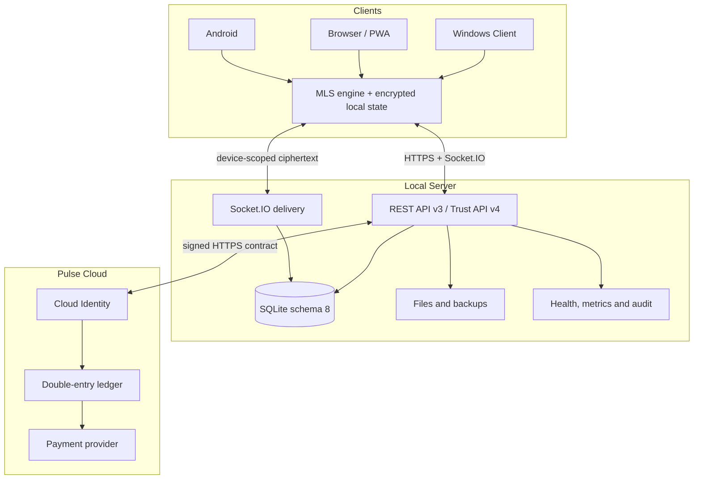

# Nexora

[](https://github.com/Onmaynec/Nexora/actions/workflows/ci.yml)


[](LICENSE)

**Nexora** — self-hosted платформа обмена сообщениями для Windows, браузера/PWA и Android. Проект объединяет локальный сервер, многоплатформенный клиент, управление комнатами, офлайн-синхронизацию, защищённые медиа, эксплуатационные инструменты и отдельный контур Nexora Pulse.

## Статус выпуска

| Линия | Назначение | Статус |
|---|---|---|
| `3.2.0` | Trust Core, MLS secure messaging, encrypted media, SQLite schema 8 | Source/PWA prerelease для контролируемого тестирования |
| `3.1.2` | Основной messaging-контур, Pulse Cloud, production hardening | Последняя подтверждённая signed production baseline |

Версия `3.2.0` прошла автоматические build, unit/API/integration, performance, security, soak и Android source gates. При этом она **не объявляется независимо аудированной E2EE-системой** и не является подписанным стабильным Windows-релизом. Подробные основания и ограничения приведены в [Release Notes 3.2.0](RELEASE_NOTES_3.2.0.md) и [Release Verification 3.2.0](RELEASE_VERIFICATION_3.2.0.md).

## Возможности продукта

### Общение и совместная работа

- личные диалоги, Saved Messages и комнаты;
- ответы, ветки, реакции, упоминания, опросы, редактирование и пересылка;
- silent и scheduled send, серверные черновики, закладки и история изменений;
- глобальный поиск, уведомления, архивирование, закрепление и фильтры;
- IndexedDB cache, delta sync и durable outbox для устойчивой работы при потере связи.

### Комнаты и администрирование

- роли `owner`, `moderator` и `member`, custom roles и категории;
- передача владения, назначение модераторов, удаление, бан и разбан;
- заявки на вступление, несколько приглашений, expiry и usage limits;
- read-only, slow mode, pre-approval, announcement mode и ограничения медиа;
- административный журнал и системные сообщения;
- server-side authorization для REST и realtime-операций.

### Файлы, изображения и голосовые

- обычные resumable uploads с проверкой размера, SHA-256 и фактического MIME-типа;
- preview изображений, PDF/text, общий медиа-архив и голосовые сообщения;
- в secure conversations — client-side AES-256-GCM encryption, opaque attachment API, progress/cancel, one-time atomic claim и verified local decrypt;
- fail-closed room policy для encrypted media, когда запрещён хотя бы один класс `files/images/voice`.

### Trust Core и MLS в 3.2.0

- Ed25519 device identity с proof-of-possession;
- сравнение fingerprint, подписанное подтверждение и отзыв устройств;
- one-time MLS KeyPackages и device-scoped Welcome delivery;
- monotonic epochs, signed commits, replay protection и missed-commit recovery;
- ciphertext-only persistence, Socket.IO delivery и durable outbox;
- encrypted IndexedDB для private MLS state, KeyPackages, decrypted cache и drafts;
- server-side downgrade guards для legacy send, edit, forward, draft, scheduled, poll, bot и upload paths.

Фиксированный MLS profile: `MLS_128_DHKEMX25519_AES128GCM_SHA256_Ed25519`.

### Nexora Plus и Pulse

- отдельная Cloud Identity с подтверждением email, MFA и OAuth 2.1 Authorization Code + PKCE;
- Nexora Plus, Impulse ledger, receipts, billing portal и room goals;
- signed Local Account ↔ Cloud Account linking;
- production entitlements только из отдельного Pulse Cloud;
- локальный sandbox для QA/demo без реальных платежей и production signatures.

### Эксплуатация и выпуск

- liveness, readiness и защищённые Prometheus metrics;
- request IDs, credential redaction и graceful drain;
- audited developer command registry без shell/eval;
- SQLite WAL/FULL, integrity checks, backup/restore, retention и quota;
- отдельные Windows Client/Server shells, PWA и Android WebView shell;
- условная публикация signed Windows assets либо безопасного Source/PWA prerelease.

## Архитектура



Local Server является источником истины для локальных аккаунтов, комнат, ролей, доступа, порядка доставки и хранения ciphertext. Pulse Cloud является отдельным authority для Cloud Identity, billing, ledger и production entitlements.

Local Server не получает private MLS state или ключи secure attachments. Он по-прежнему видит операционные metadata: account/device identifiers, membership, conversation scope, timing, IP/network context, ciphertext size, attachment ID и delivery events. Nexora `3.2.0` не заявляет защиту от traffic analysis.

Полное описание: [Architecture](docs/ARCHITECTURE.md) и [Project Index](PROJECT_INDEX.md).

## Требования

- Node.js `22.16+` и npm;
- Windows 10/11 для Electron Client/Server;
- JDK 17, Android SDK 36 и Gradle 8.13 для Android source build;
- HTTPS для PWA, Android и публичных развёртываний;
- отдельная Cloud-среда и provider credentials только для production Pulse.

## Быстрый старт для разработки

```bash
git clone https://github.com/Onmaynec/Nexora.git
cd Nexora
npm ci
npm run dev
```

Проверка полного контура:

```bash
npm run release:check
gradle -p android :app:assembleDebug --no-daemon
```

Основные команды:

| Команда | Назначение |
|---|---|
| `npm run check` | syntax checks, Electron Builder config и production web build |
| `npm test` | web build, unit/API/integration и performance suite |
| `npm run audit:security` | security invariants и production dependency audit |
| `npm run test:soak` | долговременная проверка целостности |
| `npm run dist:windows` | локальные тестовые NSIS Client/Server builds |
| `npm run release:windows` | release gate, signing gate и Windows installers |

## Развёртывание

Публичный Local Server размещайте только за HTTPS reverse proxy с ограниченным firewall, явным `allowedOrigins`, мониторингом и регулярными резервными копиями. Не публикуйте локальный порт прямым port forwarding.

Перед подключением пользователя передайте по доверенному каналу:

1. полный HTTPS-адрес;
2. Server ID;
3. SHA-256 certificate fingerprint.

Electron Client закрепляет fingerprint за Server ID. Для браузера/PWA и Android локальный CA необходимо установить в доверенное хранилище операционной системы. TLS errors не должны обходиться.

Операционные инструкции: [Administrator Guide](ADMIN_GUIDE.md) и [Deployment Guide](docs/DEPLOYMENT.md).

## Документация

Центральный каталог: **[Documentation Portal](docs/README.md)**.

| Раздел | Документ |
|---|---|
| Продукт и границы | [Product Overview](docs/PRODUCT_OVERVIEW.md) |
| Архитектура | [Architecture](docs/ARCHITECTURE.md), [Project Index](PROJECT_INDEX.md) |
| Развёртывание и эксплуатация | [Deployment](docs/DEPLOYMENT.md), [Administrator Guide](ADMIN_GUIDE.md) |
| Тестирование | [Tester Guide](TESTER_GUIDE.md), [3.2.0 Verification](RELEASE_VERIFICATION_3.2.0.md) |
| Trust Core / MLS | [Trust Core 3.2.0](docs/TRUST_CORE_3.2.0.md), [Schema 8 Migration](docs/MIGRATION_3.2.0.md) |
| Plus / Pulse | [Pulse](docs/PULSE.md), [Pulse Cloud](docs/PULSE_CLOUD.md) |
| Выпуски | [Release Policy](docs/RELEASE_POLICY.md), [Changelog](CHANGELOG.md) |
| Безопасность | [Security Policy](SECURITY.md), [Security Audit](SECURITY_AUDIT.md) |
| Ветки | [Branch Index](BRANCHES.md), [Current Release Status](BRANCH_STATUS.md) |

## Поддержка и участие

- ошибки: [Bug report](https://github.com/Onmaynec/Nexora/issues/new?template=bug_report.yml);
- предложения: [Feature request](https://github.com/Onmaynec/Nexora/issues/new?template=feature_request.yml);
- вопросы по установке и эксплуатации: [SUPPORT.md](SUPPORT.md);
- уязвимости: только приватно по инструкции в [SECURITY.md](SECURITY.md);
- правила участия: [CONTRIBUTING.md](CONTRIBUTING.md) и [CODE_OF_CONDUCT.md](CODE_OF_CONDUCT.md).

## Лицензия

Код и документация распространяются по лицензии [MIT](LICENSE).