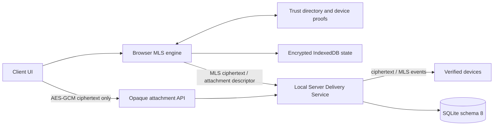

# Nexora 3.2.0 — Trust Core / MLS Development

> **Статус ветки:** experimental release development. Это не stable release и не независимо проверенная реализация E2EE. Для эксплуатации используйте `main` / Nexora 3.1.2.

Ветка добавляет Trust Core boundary и MLS 1.0 secure-message path поверх Nexora 3.1.2. Цель — исключить plaintext защищённого сообщения и вложения из Local Server transport/storage path и не допустить скрытого downgrade на legacy API.

## Реализовано

- безопасная migration Local Server к SQLite schema 8 с backup, free-space и integrity checks;
- Ed25519 device identity, signed verification и revocation;
- one-time MLS KeyPackage и conversation-scoped Welcome delivery;
- monotonic MLS group epochs, signed commits и replay protection;
- ciphertext-only Socket.IO transport, persistence и durable outbox;
- encrypted IndexedDB для private MLS state, KeyPackages, decrypted cache и drafts;
- browser MLS engine на `MLS_128_DHKEMX25519_AES128GCM_SHA256_Ed25519`;
- Trust Core-backed credential authentication;
- Secure Message Pane без plaintext fallback;
- Trusted Devices UI с fingerprint, verify, revoke и self-wipe;
- encrypted files, images и voice на AES-256-GCM с ключом и metadata внутри MLS content;
- opaque attachment API с SHA-256, exact-size validation, one-time claim, progress, cancel и expiry cleanup;
- локальный image preview, voice playback и проверяемая расшифровка перед download;
- fail-closed media policy, когда комната запрещает хотя бы один тип вложений;
- server-side guards для legacy send/forward/edit/draft/scheduled/poll/bot/upload paths;
- migration, recovery, plaintext-guard, media, functional-clock и Alice/Bob interoperability tests.

## Архитектурная граница



Local Server управляет authentication, membership, delivery order, room access, epoch/replay state, ciphertext persistence и quota. Он не получает private MLS state, attachment key, исходное имя, фактический MIME, voice waveform или plaintext content.

Сервер всё ещё видит операционные metadata: account/device identifiers, conversation/room scope, время, IP/network context, ciphertext size, attachment ID, uploader и delivery events. MLS и attachment encryption не скрывают traffic pattern.

## Безопасный отказ

- Secure conversation не переключается на legacy plaintext send/upload при ошибке MLS, offline-state, revoke или повреждении локального хранилища.
- Pending attachment недоступен для скачивания до атомарной привязки к MLS-message.
- Отмена до enqueue удаляет pending ciphertext; после enqueue запись остаётся в durable outbox для идемпотентного retry.
- Attachment descriptor обязан совпасть с server envelope по ID, ciphertext size и SHA-256.
- При частичном запрете `files/images/voice` сервер блокирует весь opaque E2EE media path: он не пытается угадать тип зашифрованного содержимого.
- Потерянное или повреждённое локальное MLS/media-состояние приводит к явной ошибке, а не к plaintext downgrade.

## Оставшиеся release blockers

- metadata minimization и traffic-analysis review;
- расширенная multi-device concurrency/revoke/re-add/corruption matrix;
- runtime E2E на Electron, PWA и Android, а не только production/source build;
- load/soak и long-offline recovery;
- финальная release verification и signing-machine checks;
- независимый cryptographic/application-security review.

## Stable baseline

Stable-линия — Nexora 3.1.2:

- API v3;
- Local Server schema 7;
- Windows, PWA и Android clients;
- Pulse Cloud/Cloud Identity 3.1.x;
- без E2EE от оператора Local Server.

Security claims этой ветки нельзя переносить в stable documentation до закрытия release blockers, полного gate и отдельного релиза.

## Документация

- [Branch status](BRANCH_STATUS.md)
- [Trust Core / MLS architecture and readiness](docs/TRUST_CORE_3.2.0.md)
- [Schema 8 migration and rollback](docs/MIGRATION_3.2.0.md)
- [3.2.0 administrator guide](ADMIN_GUIDE_3.2.0.md)
- [3.2.0 tester guide](TESTER_GUIDE_3.2.0.md)
- [3.2.0 release notes draft](RELEASE_NOTES_3.2.0.md)
- [Security policy](SECURITY.md)
- [Contributing](CONTRIBUTING.md)

## Проверки разработки

```bash
npm ci
npm run release:check
gradle -p android :app:assembleDebug --no-daemon
```

CI выполняет Windows syntax/build/unit/security gate, Linux full test suite, отдельный release gate и Android source build.

## Лицензия

Код и документация распространяются по лицензии [MIT](LICENSE).
