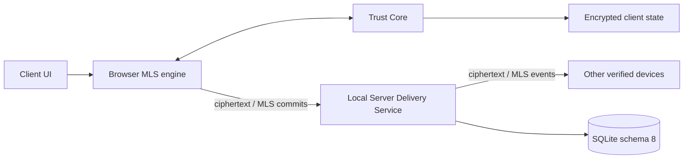

# Nexora 3.2.0 — Trust Core / MLS Development

> **Статус ветки:** experimental work in progress. Это не stable release и не готовая реализация E2EE. Для эксплуатации используйте `main` / Nexora 3.1.2.

Эта ветка развивает отдельную Trust Core boundary и MLS 1.0 transport поверх stable Nexora 3.1.2. Цель — исключить plaintext private-message content из Local Server transport/storage path, не подменяя незавершённую криптографическую работу маркетинговым заявлением.

## Текущий scope ветки

- безопасная migration Local Server к SQLite schema 8 с backup и integrity checks;
- Ed25519 device identity, verification и revocation;
- one-time MLS KeyPackage и Welcome delivery;
- monotonic MLS group epochs, signed commits и replay protection;
- ciphertext-only Socket.IO message transport для secure path;
- encrypted IndexedDB storage для private MLS state, key packages, decrypted cache и drafts;
- browser MLS engine на mandatory ciphersuite 1;
- Trust Core-backed authentication service;
- migration, recovery, plaintext-guard и interoperability tests.

## Архитектурная граница

Local Server рассматривается как Delivery Service: он управляет authorization, membership, delivery order, room access, replay state и ciphertext persistence, но не должен получать message plaintext или private MLS state.

## Что не подтверждено как release-ready

Ветка остаётся draft и не должна выпускаться до завершения и проверки:

- полного Client UI/outbox path;
- невозможности plaintext bypass во всех messaging routes и realtime events;
- dependency lockfile и reproducible build;
- полного API/MLS interoperability matrix;
- multi-device add/remove/revoke/recovery scenarios;
- encrypted attachments и metadata-leak review;
- version/release metadata и migration/rollback documentation;
- Windows/Linux/Android CI, production build, security audit и release gate;
- независимого cryptographic/security review.

## Stable baseline

Stable-линия — Nexora 3.1.2:

- API v3;
- Local Server schema 7;
- Windows, PWA и Android clients;
- Pulse Cloud/Cloud Identity 3.1.x;
- без E2EE от оператора Local Server.

Не переносите security claims этой ветки в stable documentation до merge, полного regression gate и отдельного release.

## Документация ветки

- [Branch status](BRANCH_STATUS.md)
- [Trust Core / MLS design and readiness](docs/TRUST_CORE_3.2.0.md)
- [Security policy](SECURITY.md)
- [Contributing](CONTRIBUTING.md)

## Проверки разработки

Используйте только команды, существующие в этой ветке и зафиксированные CI. Минимальный release candidate gate должен включать native/WASM Trust Core checks, Node tests, API/MLS interoperability, plaintext guards, production web build, security audit и Windows/Linux/Android CI.

## Лицензия

Код и документация распространяются по лицензии [MIT](LICENSE).
