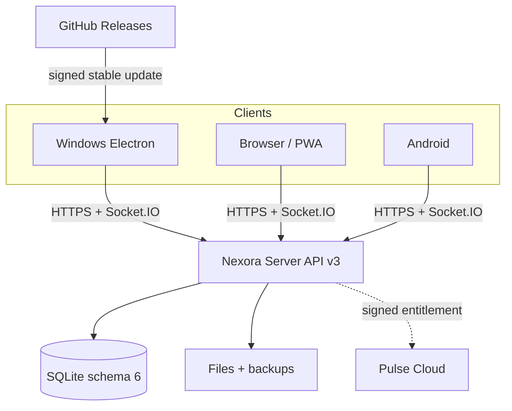

# Nexora 3.0.0

[](https://github.com/Onmaynec/Nexora/actions/workflows/ci.yml)


Nexora — self-hosted мессенджер с общим интерфейсом для Windows, браузера/PWA и Android. Версия 3.0.0 объединяет дорожную карту 2.0.1–3.0.0 в один релиз: повседневные функции мессенджера, офлайн-синхронизацию, сообщества, безопасные медиа, Nexora Plus/Pulse, эксплуатацию сервера, ботов и три клиентские платформы.

Голосовые сообщения поддерживаются. Голосовые/видеозвонки, демонстрация экрана, E2EE, криптовалюты и NFT намеренно не входят в продукт.

## Возможности 3.0.0

| Контур | Реализовано |
|---|---|
| Сообщения | личные чаты, Saved Messages, комнаты, ответы/ветки, редактирование с историей, пересылка, реакции, закладки, multi-select, silent и scheduled send, опросы, упоминания |
| Организация | архив, pin/mute, вкладки личных/комнат/непрочитанных, черновики между устройствами, фон и компактный режим чата, глобальный FTS5-поиск с фильтрами |
| Offline Relay | IndexedDB-кэш bootstrap и последних 500 сообщений чата, устойчивая outbox, event sequence API v3, delta/resync, повтор без дублей |
| Несколько серверов | сохранённые Server ID/URL/fingerprint, отдельная постоянная Electron partition на сервер, безопасное переключение и публичные HTTPS-домены |
| Сообщества | владельцы/модераторы/custom roles, разрешения, категории, несколько приглашений, заявки, временные ограничения/баны, жалобы, pre-approval, announcement/read-only/slow mode, аудит |
| Медиа | до 25 МБ, очередь и прогресс, отмена/повтор, resumable chunks по 1 МБ с SHA-256, проверка сигнатуры MIME, галерея, PDF preview, голосовые до 5 минут |
| Уведомления | центр активности, mentions/replies/security events, режим all/mentions/none, тихие часы, Windows notifications |
| Безопасность | TOTP и одноразовые recovery codes, шифрование TOTP secret AES-256-GCM, CSRF/Origin, HttpOnly cookie, login lock/rate limits, TLS pinning, webhook SSRF-защита |
| Эксплуатация | SQLite schema 6, migration backup, WAL/FULL, integrity checks, encrypted backup/restore, quota/retention, read-only emergency mode, Stable/Preview channel, metrics |
| Автоматизация | отдельные bot accounts, hashed scoped API tokens, 60 req/min, room isolation, signed outgoing HTTPS webhooks и integration audit |
| Plus/Pulse | sandbox без денег и production contract с HTTPS Cloud, Ed25519 entitlement, idempotency, ledger/goals/refund boundary |
| Платформы | Electron Client/Server для Windows, устанавливаемая PWA, Android HTTPS WebView shell с deep link `nexora://connect` |

## Архитектура



Server является authority аккаунтов, сообщений, ролей и файлов. Клиенты хранят только scoped cache/outbox. Production Pulse Cloud остаётся отдельным денежным trust boundary; локальный флаг не создаёт реальную покупку.

Подробнее: [архитектура](docs/ARCHITECTURE.md) и [карта проекта/API](PROJECT_INDEX.md).

## Быстрый старт

### Windows / LAN / Radmin VPN

1. Установите и запустите `Nexora-Server-Setup-3.0.0.exe` на компьютере владельца.
2. Скопируйте показанный HTTPS-адрес и SHA-256 сертификата.
3. В `Nexora Client` добавьте сервер и сверьте fingerprint на компьютере владельца.
4. Первый зарегистрированный аккаунт становится администратором.

Для Electron Client устанавливать CA не требуется: сертификат закрепляется за Server ID после явного подтверждения. Для браузера и Android установите экспортированный `nexora-local-ca.crt` в доверенные сертификаты ОС. Ни один клиент не обходит TLS-ошибки.

Публичный домен разрешён только по HTTPS. Для internet deployment используйте reverse proxy, ограниченный firewall, резервное копирование и явный `allowedOrigins`; не публикуйте локальный порт без защиты.

### PWA

Откройте HTTPS-адрес Server в Chrome/Edge и выберите «Установить приложение». Service worker не кэширует `/api` или Socket.IO; офлайн-история хранится отдельно в IndexedDB после успешной авторизации.

### Android

Android source находится в [`android/`](android/README.md). Требуются JDK 17, Android SDK 36 и Gradle 8.13:

```bash
gradle -p android :app:assembleRelease
```

Клиент принимает QR/deep link `nexora://connect?url=<HTTPS URL>`, ограничивает навигацию origin сервера, запрещает HTTP/mixed content/third-party cookies и всегда вызывает `cancel()` при TLS-ошибке.

## Сборка и проверка

Требования: Node.js 22.16+ и npm.

```bash
git clone https://github.com/Onmaynec/Nexora.git
cd Nexora
npm ci
npm run check
npm test
npm run audit:security
```

Windows test installers:

```bat
npm run dist:windows
```

Результат: `Nexora-Client-Setup-3.0.0.exe` и `Nexora-Server-Setup-3.0.0.exe`. Неподписанные локальные сборки предназначены только для тестов.

Текущий automated contour: 51/51 тест, Windows/Linux CI, Android source build, load 20 clients/120 messages, migration/backup/restore, crash durability, TOTP, API v3, bots, MIME/SSRF и UI regression профиля.

## GitHub Release и автообновление

Commit `release:` в `main` после успешного CI создаёт неизменяемый аннотированный тег `v3.0.0`. Workflow сверяет SemVer и всегда формирует source ZIP, PWA ZIP, SPDX SBOM и SHA-256.

- Если настроены `WINDOWS_CERTIFICATE_BASE64` и `WINDOWS_CERTIFICATE_PASSWORD`, workflow собирает подписанные Client/Server, проверяет `.exe`, `.blockmap`, `latest.yml` и только затем публикует стабильный Latest-релиз.
- Если secrets отсутствуют, workflow успешно публикует Source/PWA prerelease. Windows update metadata и неподписанные `.exe` в него не попадают.

Так релиз больше не исчезает из-за signing gate, но updater по-прежнему никогда не получает неподписанный бинарный файл. Подробности: [GitHub Release Guide](docs/GITHUB_RELEASE.md).

## Nexora Plus / Pulse

Режимы Server:

- `disabled` — коммерческие возможности отключены;
- `sandbox` — Plus и импульсы тестируются без денег;
- `production` — checkout/entitlement/ledger только через отдельно развёрнутый Pulse Cloud.

Production требует `NEXORA_PULSE_CLOUD_URL`, `NEXORA_PULSE_API_KEY`, `NEXORA_PULSE_PUBLIC_KEY`, провайдера платежей, webhook/refund/dispute flow и юридических документов. См. [Pulse](docs/PULSE.md).

## Границы безопасности

- сообщения не имеют E2EE и доступны администратору компьютера Server;
- secrets, PFX/P12, базы и пользовательские вложения исключены из Git;
- Windows stable updater требует Authenticode и `verifyUpdateCodeSignature`;
- bot tokens показываются один раз и хранятся только как hash;
- webhooks принимают только публичные HTTPS-адреса и используют DNS pinning/HMAC;
- перед schema migration создаётся SQLite backup, а restore проверяет integrity.

## Документация

- [Release Notes 3.0.0](RELEASE_NOTES_3.0.0.md)
- [Отчёт верификации 3.0.0](RELEASE_VERIFICATION_3.0.0.md)
- [Changelog](CHANGELOG.md)
- [Руководство администратора](ADMIN_GUIDE.md)
- [Руководство тестера](TESTER_GUIDE.md)
- [Архитектура](docs/ARCHITECTURE.md)
- [Nexora Plus / Pulse](docs/PULSE.md)
- [Боты и интеграции](docs/AUTOMATIONS.md)
- [GitHub Releases](docs/GITHUB_RELEASE.md)
- [Release checklist](docs/RELEASE_CHECKLIST.md)
- [Security](SECURITY.md) и [security audit](SECURITY_AUDIT.md)

Публичный репозиторий: [Onmaynec/Nexora](https://github.com/Onmaynec/Nexora).
