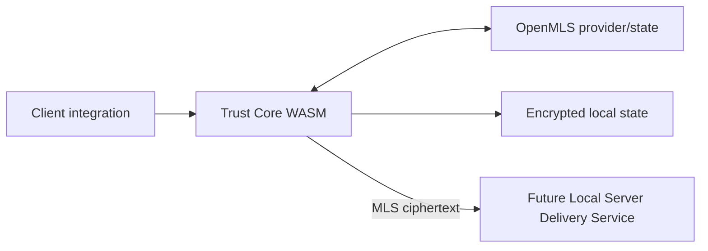

# Nexora 3.2.0 — Trust Core Foundation

> **Статус ветки:** experimental foundation / draft. Это не stable release, не production build и не завершённое E2EE.

Эта ветка создаёт отдельную Rust/WebAssembly Trust Core boundary на базе OpenMLS 0.8.1 и MLS 1.0. Stable baseline проекта — Nexora 3.1.2 на `main`; stable messages по-прежнему доступны оператору Local Server.

## Реализуемый foundation scope

- pinned Rust workspace и OpenMLS 0.8.1 dependencies;
- MLS mandatory ciphersuite 1:
  - X25519;
  - ChaCha20-Poly1305;
  - SHA-256;
  - Ed25519;
- persisted device credentials и signing identities;
- MLS KeyPackages;
- group create/load/join/add-member lifecycle;
- application-message encryption/decryption;
- provider-state integrity snapshots;
- exported group secrets для будущего encrypted-attachment contour;
- native и WebAssembly compilation gates;
- encrypted client-state/repository/schema integration experiments.

## Архитектурное направление

Trust Core должен владеть private signing/MLS state и cryptographic operations. Local Server Delivery Service, key transparency, secure-channel UI и complete cross-device path ещё не считаются завершёнными в этой foundation branch.

## Не является готовым

- Local Server ciphertext-only delivery path;
- key transparency и device verification UX;
- complete add/remove/revoke/recovery lifecycle;
- encrypted drafts/cache/outbox integration;
- secure-channel UI;
- plaintext fallback prevention;
- full API/MLS interoperability;
- production migration, release metadata и operator guides;
- independent cryptographic review.

Существующий plaintext messaging нельзя переименовывать в E2EE. Branch code разрешено использовать только с disposable test data.

## Документация ветки

- [Branch status](BRANCH_STATUS.md)
- [Trust Core foundation](docs/TRUST_CORE_3.2.0.md)
- [Security policy](SECURITY.md)
- [Contributing](CONTRIBUTING.md)

## Stable baseline

Для production используйте `main` / Nexora 3.1.2: API v3, schema 7, Windows/PWA/Android, Pulse Cloud 3.1.x и документированные ограничения без E2EE.

## Лицензия

Код и документация распространяются по лицензии [MIT](LICENSE).
