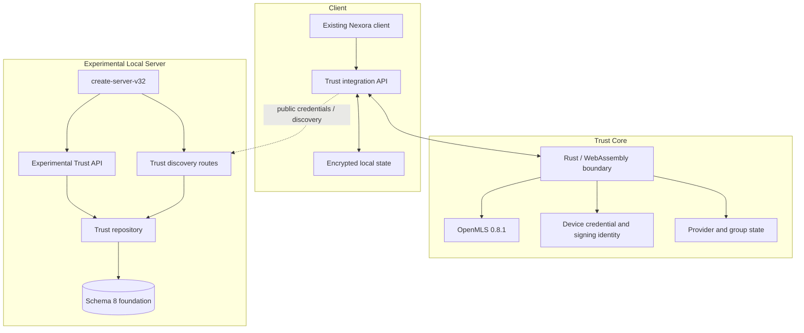

# Архитектура Nexora 3.2.0 Trust Core Foundation

> Draft architecture for `agent/nexora-3.2.0-trust-core`. Stable production architecture remains Nexora 3.1.2 on `main`.

## Components

## Stable baseline

The branch starts from Nexora 3.1.x concepts but is not a synchronized stable release branch. Stable `main` uses API v3, schema 7, Pulse Cloud 3.1.x and does not provide E2EE.

Trust Core work is additive research/development. Existing plaintext messaging must remain explicitly identified as plaintext until a complete secure Delivery Service path replaces it for a conversation.

## Trust Core responsibilities

Trust Core owns:

- device signing identity generation/use;
- MLS credentials and KeyPackages;
- group create/load/join/add-member cryptographic lifecycle;
- application-message encryption/decryption;
- provider/group-state serialization and integrity snapshots;
- exported group-secret derivation interface;
- stable error mapping across native/WASM boundaries.

The target suite is MLS mandatory ciphersuite 1: X25519, ChaCha20-Poly1305, SHA-256 and Ed25519.

## JavaScript/browser boundary

The browser integration layer may request operations and persist encrypted state, but it must not:

- receive unnecessary private key material;
- log secrets or serialized private group state;
- treat a Trust Core error as permission to send plaintext;
- mix state between Server ID, local account, browser profile or device;
- accept stale/corrupt state without explicit failure.

## Experimental Local Server foundation

`create-server-v32`, Trust discovery routes, Trust v4 routes, repository and schema 8 are preparatory integration components. They do not yet constitute a complete MLS Delivery Service.

The eventual Server role is expected to include authenticated device discovery, KeyPackage/Welcome delivery, room authorization, ordering/replay records and ciphertext persistence without private MLS keys or message plaintext.

## Schema 8 foundation

Schema 8 work must preserve stable migration invariants:

1. verify source schema and integrity;
2. check free space;
3. create and verify pre-migration backup;
4. migrate transactionally and idempotently before network listen;
5. prevent silent downgrade;
6. verify post-migration integrity.

A schema migration does not retroactively encrypt old message rows.

## Encrypted state

The encrypted-state module is a foundation for storing Trust/MLS private state. Release design must define:

- storage-key source and lifecycle;
- authenticated encryption/versioning;
- rollback/corruption detection;
- profile/server/device isolation;
- concurrent access behavior;
- key loss and recovery;
- secret-free diagnostics.

## Exported group secrets

Exported secrets are only an input to a future attachment-encryption design. A production construction still requires domain separation, per-attachment derivation, nonce policy, authenticated metadata, chunk/stream semantics, epoch handling and deletion/cache rules.

## Missing end-to-end contours

- production device verification/revocation and transparency;
- atomic one-time KeyPackage/Welcome delivery;
- complete group member removal/update/recovery;
- ciphertext-only REST/Socket.IO delivery;
- secure UI and durable outbox;
- plaintext-bypass guards for all message paths;
- attachment encryption;
- native/WASM/browser/server interoperability matrix;
- operator migration/rollback and user recovery documentation;
- full release gates and independent cryptographic review.

See [TRUST_CORE_3.2.0.md](TRUST_CORE_3.2.0.md) and [../BRANCH_STATUS.md](../BRANCH_STATUS.md).
