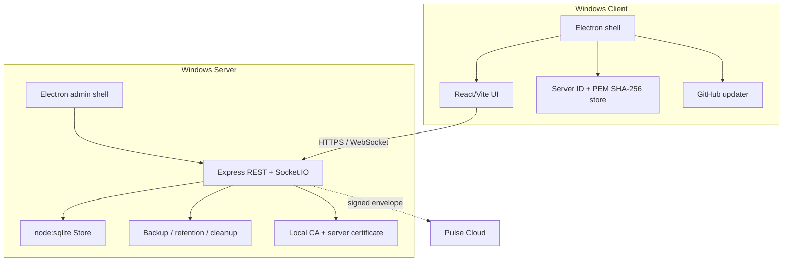

# Архитектура Nexora 2.0.0

## Компоненты

## Поток подключения

1. Client нормализует URL и принимает только HTTPS local/LAN/Radmin address.
2. Health probe получает Server ID, API compatibility, PEM и SHA-256.
3. Для нового сервера пользователь сверяет fingerprint.
4. Electron session certificate verifier разрешает только совпавшие host/Server ID/fingerprint.
5. Renderer загружает web client, а API добавляет secure session + CSRF token.

## Данные

`server/store.cjs` использует SQLite schema 5, WAL и `synchronous=FULL`. `mutate()` сериализует операции, открывает `BEGIN IMMEDIATE`, применяет diff/UPSERT всех нормализованных коллекций и делает commit/rollback.

FTS5 индексируется triggers на messages. Вложения лежат отдельно и связываются метаданными; сообщение и attachment metadata фиксируются транзакционно. Maintenance отвечает за backup/restore, expiry и orphan cleanup.

## Realtime и offline

REST используется для bootstrap, history, search, upload и настроек; Socket.IO — для сообщений, typing, presence, read/delivery и room events. Текстовые сообщения имеют client ID и outbox, поэтому повтор после обрыва идемпотентен.

## Trust boundaries

- Client renderer не имеет Node integration.
- Desktop shell отвечает за сертификаты и updates.
- Server является authority локального контента/ролей.
- Pulse Cloud является authority денег/entitlement production.
- GitHub Release является update source Client только после code signing и публикации владельцем.

## Совместимость

Server сообщает API version 2 и диапазон Client. Client 2.0.0 отклоняется Server другой major-версии; schema migration выполняется автоматически до открытия traffic.
