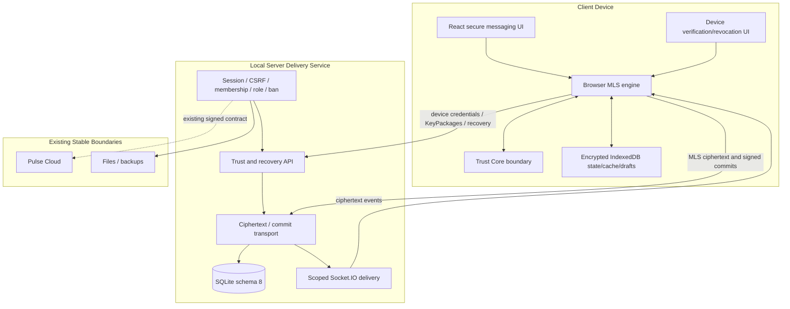

# Архитектура Nexora 3.2.0 Trust Core / MLS — Development

> Draft architecture for `agent/nexora-3.2.0-trust-core-mls`. Stable production architecture remains Nexora 3.1.2 on `main`.

## Components

## Baseline

The branch is based on the 3.1.x product line:

- API v3;
- Local Server schema 7 before Trust migration;
- stable room/auth/file/Pulse contours;
- Windows, PWA and Android shells;
- no stable E2EE guarantee.

Schema 8 and secure messaging are additive development contours. Existing authorization and room restrictions remain server-authoritative.

## Trust Core boundary

Trust Core is responsible for cryptographic identities, MLS credentials, KeyPackages, group state and encryption/decryption. Private signing and MLS state must not be sent to Local Server.

The branch targets MLS mandatory ciphersuite 1:

- X25519;
- ChaCha20-Poly1305;
- SHA-256;
- Ed25519.

The JavaScript/browser layer orchestrates calls and user-visible state but must not silently replace a Trust Core failure with plaintext messaging.

## Device identity

Each device has a distinct public credential and signing identity. Local Server stores only public identity/status and authenticated audit data.

Required states:

- registered;
- unverified/verified;
- revoked;
- replacement/recovery pending;
- inactive/expired where applicable.

Verification and revocation must be authenticated, monotonic, audited and propagated to conversation delivery state. A revoked device must not receive new KeyPackages, Welcome data, commits or application ciphertext.

## KeyPackage and Welcome delivery

- KeyPackages are one-time and device-scoped.
- Publish/consume operations require an active non-revoked device.
- Consumption and Welcome delivery state are atomic.
- Duplicate, expired, foreign or substituted data is rejected.
- Server never reconstructs private MLS material.

## Group and epoch model

A secure conversation maps to an MLS group. Accepted membership changes use signed commits and advance a monotonic epoch.

Server transport validates:

- authenticated sender/device;
- current room/conversation access;
- expected group and epoch;
- replay/order identity;
- commit/application message class;
- receiver visibility after membership/device changes.

Server does not validate plaintext content because it must not possess it.

## Ciphertext messaging

Secure application messages travel as ciphertext through REST/Socket.IO/outbox paths. The Server persists ciphertext and delivery metadata only for the secure path.

No fallback is allowed when a conversation is marked secure. Guards must cover message create, realtime send, drafts, scheduled messages, replies, edits, forwarding, bots/integrations and compatibility routes.

## Encrypted client state

Private MLS state, KeyPackages, decrypted cache and secure drafts are stored encrypted in IndexedDB. Release readiness requires:

- profile/server/device isolation;
- authenticated encryption and explicit versioning;
- rollback/corruption detection;
- deterministic error handling;
- no secret material in logs/crash reports;
- safe key loss/recovery behavior;
- no plaintext persistence in ordinary caches.

## Schema 8 migration

Migration from stable schema 7 must execute before network listen:

1. schema and integrity verification;
2. free-space check;
3. verified pre-migration backup;
4. transactional/idempotent schema changes;
5. migration of applicable conversation/device metadata;
6. downgrade protection;
7. post-migration integrity verification.

Existing plaintext history requires an explicit product/migration policy; adding schema 8 does not retroactively encrypt old messages.

## Recovery

Recovery routes/state coordinate lost or replacement devices without giving Local Server access to private group secrets. Required checks include current-account authorization, device revocation, one-time recovery artifacts, audit, replay prevention, rekey and explicit failure when secure state cannot be recovered.

## Stable trust boundaries preserved

- Local Server remains authority for local accounts, rooms, roles, membership, bans, files and delivery authorization.
- Pulse Cloud remains authority for Cloud Identity, billing/ledger and production entitlements.
- Desktop shell remains authority for certificate pinning and signed updates.
- Android/PWA keep strict HTTPS/origin behavior.
- Bot/webhook contours must not gain implicit access to secure plaintext.

## Release blockers

- complete UI and outbox integration;
- exhaustive plaintext-bypass prevention;
- reproducible dependency/build lock;
- full native/WASM/browser/server interoperability;
- multi-device add/remove/revoke/recovery matrix;
- attachment encryption and metadata review;
- migration/rollback/operator documentation;
- stable versioning and release metadata;
- full CI/security/load/soak gates;
- independent cryptographic review.

See [TRUST_CORE_3.2.0.md](TRUST_CORE_3.2.0.md) and [../BRANCH_STATUS.md](../BRANCH_STATUS.md).
