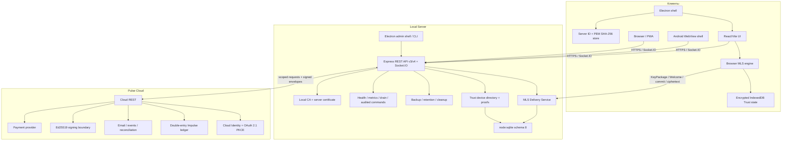

# Архитектура Nexora 3.2.0 — development

> Stable production baseline: Nexora 3.1.2. Trust Core/MLS sections describe PR #12 and are not an independent security certification.

## Компоненты

## Поток подключения к Local Server

1. Client нормализует URL и принимает только HTTPS localhost/LAN/Radmin/public-domain address.
2. Health probe получает Server ID, API compatibility, PEM certificate и SHA-256 fingerprint.
3. Для нового сервера пользователь сверяет fingerprint по доверенному каналу.
4. Electron создаёт отдельную persistent session для каждого Server ID; certificate verifier разрешает только совпавшие host/Server ID/fingerprint.
5. Renderer загружает web client, а API создаёт secure HttpOnly session и выдаёт CSRF token.
6. Client настраивает Trust scope по `(Server ID, local user ID)` и загружает/создаёт локальную device identity.
7. После потери membership/доступа Server прекращает room/MLS events и отклоняет последующие REST/Socket.IO операции.

## Stable data model и schema 8

`server/store.cjs` использует SQLite, WAL и `synchronous=FULL`. Изменения сериализуются, выполняются в транзакциях и фиксируются только после server-side authorization, role/membership/ban checks и валидации.

Schema 7 baseline включает:

- users, sessions, rooms, messages, files, reactions, notifications и audit;
- v3 events, drafts, scheduled messages, polls, edit history, invites, reports, appeals, roles, categories, bots и webhooks;
- Cloud account links, Pulse signing keys, entitlement/cache/event state;
- checkout/transaction cache и room product state.

Schema 8 добавляет:

- `trust_challenges`;
- `trust_devices` и `trust_device_verifications`;
- `mls_key_packages`;
- `mls_groups` и `mls_group_members`;
- `mls_welcome_queue`;
- `mls_commit_log`;
- `mls_replay_cache`;
- `trust_audit`.

Миграция 7 → 8 выполняется до network listen: source integrity check, free-space check, WAL checkpoint, verified SQLite backup, `BEGIN IMMEDIATE`, post-migration integrity check и downgrade protection. Подробности: [MIGRATION_SCHEMA8.md](MIGRATION_SCHEMA8.md).

Existing schema 7 messages/files не переписываются и не становятся E2EE ретроактивно.

## Trust Core и device lifecycle

### Public server-side state

Local Server хранит:

- public Ed25519 identity/signature keys;
- MLS credential и device fingerprint;
- active/revoked и verified/unverified state;
- одноразовые challenge, KeyPackage/Welcome delivery records;
- group membership, epoch, commit ciphertext/hash и replay cache;
- scoped audit metadata.

Private identity key, private MLS state и plaintext secure message server не хранит.

### Signed device operations

- регистрация подтверждает possession identity key;
- первый device получает bootstrap verification;
- последующие devices требуют signed `verify_device` challenge от verified device;
- revoke использует отдельный одноразовый `revoke_device` challenge;
- self-revoke очищает local wrapping key, device record, KeyPackages, group state, decrypted cache и drafts;
- revoked device сразу теряет KeyPackage/Welcome/commit/ciphertext delivery rights.

## MLS secure-message lifecycle

Фиксированный profile: `MLS_128_DHKEMX25519_AES128GCM_SHA256_Ed25519`.

1. Verified device публикует one-time KeyPackages.
2. Group creator атомарно claims KeyPackage целевого device.
3. MLS Add commit увеличивает epoch ровно на один.
4. Welcome адресуется конкретному `(user, device, conversation)`.
5. Recipient joins group и удаляет использованный private KeyPackage.
6. Composer создаёт MLS application ciphertext до помещения в durable outbox.
7. Local Server проверяет session/device/conversation/group/epoch/replay, сохраняет ciphertext и доставляет его active members.
8. Recipient проверяет authenticated data и decrypts локально.
9. Offline client получает непрерывную commit chain; разрыв является hard failure.

Credential authentication разрешает только active/verified device с совпадающим registered signature key. `accept-all` authentication не используется.

## Encrypted client storage

`client/src/crypto/trust-store.js` использует IndexedDB scope `(Server ID, local user ID)`.

- wrapping key: non-extractable AES-256-GCM CryptoKey;
- identity signing key: non-extractable Ed25519 private CryptoKey;
- MLS signing/private package bytes: sealed AES-GCM record;
- private group state: sealed AES-GCM record;
- decrypted cache и drafts: sealed AES-GCM record;
- AAD связывает ciphertext с scope, record key и purpose.

Browser renderer остаётся частью trusted computing base: XSS, dependency compromise или malicious client binary могут получить plaintext во время использования.

## Ciphertext-only enforcement

После появления active MLS group Local Server запрещает plaintext creation через:

- Socket.IO `message:send` и `message:forward`;
- legacy edit path;
- server drafts и scheduled messages;
- polls;
- bot message API;
- chunked upload initiation/completion;
- другие v3 routes, использующие legacy text service.

Serializer возвращает для encrypted message пустой `text` и MLS envelope. Preview нейтрален: «Защищённое сообщение».

Attachments/images/voice в Secure Message Pane отключены до реализации encrypted-media protocol. Это fail-closed policy, а не завершённая media security.

## Realtime и offline

REST используется для bootstrap, history, settings, Trust directory, KeyPackage/Welcome/commit recovery и commercial management. Socket.IO используется для presence/read state, legacy messages и MLS ciphertext events.

API v3 сохраняет event sequence/delta sync. Trust API v4 добавляет device/group endpoints. Secure outbox имеет idempotent `clientId`; replay cache блокирует повторный ciphertext hash.

PWA Service Worker кэширует только application shell. API/Socket.IO исключены. Android использует тот же HTTPS web client, ограничивает navigation origin сервера и отменяет TLS errors.

## Pulse trust boundary

Local Server отправляет в Cloud только данные конкретной Cloud Identity/billing operation. Production entitlement и authoritative ledger state создаются только Pulse Cloud.

Local Server проверяет HTTPS origin, scoped credential, request ID/timestamp/nonce/idempotency, Ed25519 envelope/entitlement signatures, authoritative scope, activation/expiry и replay.

Pulse Cloud не получает messages, files, room history, local password/session cookie, Trust private keys или local CA private key. Local Server не получает card data, Cloud password/MFA secret, signing private key или OAuth refresh token.

## Operational runtime

Local Server и Pulse Cloud публикуют liveness/readiness и protected Prometheus metrics. Operational middleware назначает request ID и скрывает credentials. Graceful shutdown сначала включает drain state, затем останавливает workers, HTTP/Socket.IO и SQLite.

## Trust boundaries

- Client renderer не имеет Node integration.
- Desktop shell отвечает за certificate trust, isolated sessions и signed updates.
- Browser MLS engine/private state являются client-side cryptographic boundary.
- Local Server является authority authentication, local membership/roles, Trust public directory, delivery order и ciphertext storage.
- Pulse Cloud является authority Cloud Identity, money, ledger и production entitlements.
- Bot API ограничен scopes и не может создавать plaintext в active MLS conversation.
- Outgoing webhook разрешён только на public HTTPS endpoint после DNS/IP validation и подписывается HMAC.

## Совместимость и ограничения

- Runtime version: 3.2.0 development.
- API: stable v3 плюс Trust API v4.
- SQLite: schema 8.
- Stable 3.1.2 client не поддерживает secure 3.2.0 conversation.
- Existing 3.1.x history не шифруется автоматически.
- Attachments и traffic metadata пока не защищены MLS path.
- Ветка не считается release-ready без runtime E2E, expanded multi-device matrix, load/soak, signing checks и independent review.
