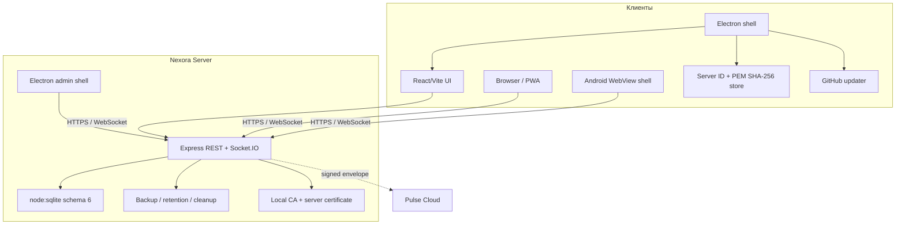

# Архитектура Nexora 3.0.0

## Компоненты

## Поток подключения

1. Client нормализует URL и принимает только HTTPS localhost/LAN/Radmin/public-domain address.
2. Health probe получает Server ID, API compatibility, PEM и SHA-256.
3. Для нового сервера пользователь сверяет fingerprint.
4. Electron создаёт отдельную persistent session для каждого Server ID; certificate verifier разрешает только совпавшие host/Server ID/fingerprint.
5. Renderer загружает web client, а API добавляет secure session + CSRF token.

## Данные

`server/store.cjs` использует SQLite schema 6, WAL и `synchronous=FULL`. Перед повышением schema создаётся migration backup. `mutate()` сериализует операции, открывает `BEGIN IMMEDIATE`, применяет diff/UPSERT нормализованных коллекций и делает commit/rollback. Расширяемые сущности v3 хранятся в отдельном типизированном registry.

FTS5 индексируется triggers на messages. Вложения лежат отдельно и связываются метаданными; сообщение и attachment metadata фиксируются транзакционно. Maintenance отвечает за backup/restore, expiry и orphan cleanup.

## Realtime и offline

REST используется для bootstrap, history, search, upload и настроек; Socket.IO — для сообщений, typing, presence, read/delivery и room events. API v3 выдаёт монотонную event sequence и delta/resync. Текстовые сообщения имеют client ID и устойчивую outbox, а resumable upload — upload ID, индекс chunk и SHA-256.

PWA кэширует только статическую оболочку Service Worker; API и Socket.IO туда не попадают. Авторизованные bootstrap/messages хранятся отдельно в IndexedDB. Android использует тот же HTTPS web client, ограничивает навигацию origin сервера и никогда не обходит TLS-ошибку.

## Trust boundaries

- Client renderer не имеет Node integration.
- Desktop shell отвечает за сертификаты, изоляцию серверных sessions и updates.
- Server является authority локального контента/ролей.
- Pulse Cloud является authority денег/entitlement production.
- Bot API ограничен scopes и room membership; outgoing webhook разрешён только на публичный HTTPS endpoint после DNS-проверки.
- GitHub Release является update source Client только после code signing и публикации владельцем.

## Совместимость

Server сообщает API version 3 и диапазон Client major 2–3. Nexora 3.0.0 использует v3-возможности, сохраняя базовый вход для 2.x. Несовместимый Client получает HTTP 426; schema migration выполняется до открытия traffic.
