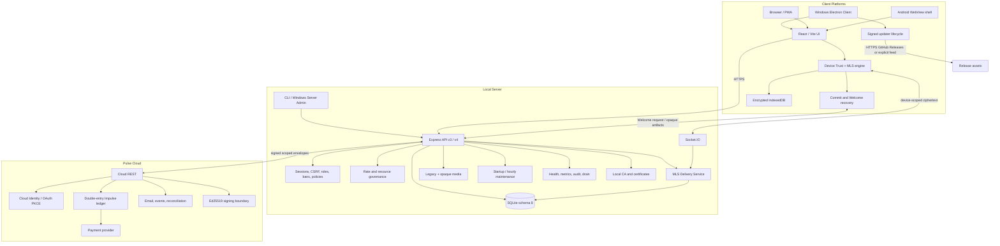

# Архитектура Nexora

## 1. Область

Документ описывает `main` версии `3.3.2`:

- Application API: v3;
- Trust/MLS/encrypted-media API: v4;
- Local Server database: SQLite schema 8;
- distribution: published `UNSIGNED-TEST` prerelease;
- signed production baseline: `3.1.2`;
- independent cryptographic/application-security review: не завершён.

## 2. System view

## 3. Authority boundaries

### Client

- UI, input и local interaction state;
- certificate/fingerprint confirmation в supported shell;
- offline cache и durable outbox;
- private device identity и MLS state;
- secure-message/media encryption/decryption;
- strict recovery validation;
- active-member Welcome creation;
- local preview/playback/download;
- Windows update UI и post-update state.

### Local Server

- local identity и sessions;
- room membership, roles, bans, restrictions и policies;
- message ordering и realtime authorization;
- public Trust directory/device status;
- resource ceilings и route rate limits;
- MLS group membership, epochs, commit/replay log;
- scoped Welcome request routing;
- ciphertext persistence/delivery;
- storage quota, retention, backup и audit.

### Pulse Cloud

- Cloud Identity и MFA;
- OAuth 2.1 Authorization Code + PKCE;
- billing, receipts и subscriptions;
- Impulse ledger;
- provider reconciliation;
- signed production entitlements.

### Release infrastructure

- immutable tag;
- source revision;
- Authenticode signing;
- installer/blockmap/`latest.yml` integrity;
- Source/PWA/SBOM/checksum artifacts.

## 4. Client connection flow

1. Client normalizes URL and requires HTTPS outside development.
2. Health probe obtains Server ID, compatibility и certificate fingerprint.
3. User verifies fingerprint through trusted channel.
4. Electron creates persistent session partition per Server ID.
5. Certificate verifier accepts expected host, Server ID и fingerprint only.
6. Local Server creates secure HttpOnly session and CSRF token.
7. Authenticated Client loads bootstrap before Trust enrollment.
8. Client configures Trust scope `(Server ID, local user ID)` before child draft effects.
9. Realtime authentication includes active Trust `deviceId`.
10. Membership, ban/restriction или Trust loss immediately affects REST/realtime.

## 5. Data model

Schema 7 contains local accounts, rooms, messages, media, audit, automations и Pulse integration state.

Schema 8 adds:

- Trust challenges;
- device records;
- KeyPackages;
- MLS groups/members;
- Welcome queue и requests;
- commit log;
- replay cache;
- Trust audit;
- secure-message/opaque-attachment state;
- persistent rate-limit state.

Migration `7 → 8` executes before network listen with source integrity, free-space check, WAL checkpoint, verified backup, transactional/idempotent migration, destination integrity и downgrade protection.

No migration is required between 3.2.0–3.3.2.

## 6. Authorization pipeline

Mutating operation requires:

1. session;
2. Origin;
3. CSRF;
4. resource existence;
5. membership;
6. role/permission;
7. active-ban/restriction check;
8. room policy;
9. input scope/validation;
10. rate/resource limit.

Trust mutation additionally requires `X-Nexora-Device-ID`, active/verified device и scoped challenge/signature where applicable.

Active ban overrides stale membership. Realtime rooms are removed when access changes.

## 7. Trust device lifecycle

- Client creates non-extractable Ed25519 identity/signature keys;
- identity и MLS signature roles use distinct keys;
- registration proves possession and binds BasicCredential to `{ userId, deviceId }`;
- first device receives bootstrap verification;
- later device requires signed approval;
- maximum 16 active devices/user;
- verification и revocation use separate one-time challenges;
- revocation disconnects target socket and triggers local scope wipe.

## 8. KeyPackage lifecycle

- upload maximum 25/request;
- inventory maximum 32/device and 256/user;
- limits enforced atomically;
- package one-time, expiring и scope-bound;
- Welcome scoped to user/device/conversation;
- expired inventory cleaned by maintenance.

## 9. MLS message lifecycle

Fixed profile: `MLS_128_DHKEMX25519_AES128GCM_SHA256_Ed25519`.

1. Verified devices publish KeyPackages.
2. Creator claims target package atomically.
3. Add commit advances epoch exactly once.
4. Welcome delivered to exact target device.
5. Composer encrypts before durable outbox enqueue.
6. Server validates account/device/access/group/epoch/replay.
7. Server persists ciphertext and emits only active verified group devices.
8. Recipient validates authenticated data and decrypts locally.

## 10. Welcome recovery baseline 3.3.0

When verified pending device has no group state:

1. it calls `POST /api/v4/trust/conversations/:conversationId/welcome/request`;
2. Server applies session, Origin/CSRF, access, active-ban, verified-device и bounded-rate checks;
3. Server emits scoped `mls.welcome_requested` only to active verified group devices;
4. active Client creates commit/Welcome;
5. pending Client retries one-time claim for bounded period;
6. absence of active member remains explicit fail-closed state.

Server receives no private keys, exporter secrets or plaintext.

## 11. Missed-commit recovery

Client validates before persistence:

- group/conversation scope;
- contiguous epochs;
- SHA-256 commit payload hashes;
- duplicate hashes;
- every intermediate/final public-state hash.

Server enforces unique group epoch/commit hash and replay controls. Total private-state loss may be unrecoverable.

## 12. Encrypted client storage

Trust state is scoped by `(Server ID, local user ID)`:

- non-extractable AES-256-GCM wrapping key;
- non-extractable Ed25519 keys;
- sealed MLS state, KeyPackages, decrypted cache и drafts;
- AAD binds scope, record key и purpose.

Renderer remains part of TCB.

## 13. Ciphertext-only enforcement

Active MLS conversation rejects plaintext through legacy send, forward, edit, draft, scheduled, poll, bot, multipart/resumable upload and incompatible Socket.IO paths. Serializer exposes an MLS envelope and neutral preview only.

## 14. Encrypted media

- random AES-256-GCM key/IV;
- AAD binds conversation, attachment ID и kind;
- plaintext/ciphertext hashes;
- private descriptor inside MLS content;
- generic ciphertext storage;
- exact size/hash checks;
- pending expiry/cancel;
- idempotent retry;
- one-time atomic claim;
- local verified decrypt/preview/playback/download.

Any disabled room media class blocks complete opaque path fail-closed.

## 15. Rate limits и maintenance

Shared memory-bounded sliding-window limiter protects Trust, recovery и E2EE routes and returns `429 RATE_LIMITED` with `Retry-After`.

Startup/hourly maintenance removes expired sessions, login history older than 90 days, stale rate-limit buckets, expired Trust state и orphan/pending upload data according to policy.

## 16. Windows updater architecture

- service initializes before renderer update IPC access;
- packaged Client defaults to GitHub Releases provider;
- custom generic feed requires explicit HTTPS config;
- initial and scheduled checks use single-flight;
- UI receives checking/progress/current/available/downloaded/error states;
- no downgrade/prerelease;
- code-signature verification remains enabled;
- unsigned asset set is not updater-eligible;
- post-update summary links exact official tag;
- `--test-mode` tails existing local log only.

## 17. Server operator console

CLI and Electron Server Admin use one allowlisted command registry. IPC returns stable `{ code, message }`; placeholders are inert values. Shell, eval и arbitrary filesystem execution are absent. Mutating actions are audited without secret arguments.

## 18. Pulse boundary

Local Server verifies Cloud HTTPS origin, service credential, request ID/timestamp/nonce/idempotency, Ed25519 envelope/entitlement, scope/expiry и replay state.

Pulse Cloud does not receive local messages/files/private Trust state. Local Server does not receive card data, Cloud password/MFA secret, signing key or OAuth refresh token.

## 19. Operations

Local Server и Pulse Cloud expose liveness, readiness, protected metrics, request IDs, credential redaction и graceful drain. SQLite uses verified backup/restore and integrity checks.

## 20. Release metadata boundary

`package.json` является источником SemVer. CI сравнивает lockfile, Android metadata, Client handshake, README, Project Index, Architecture, Security Model и current release evidence. Post-publication workflow скачивает Client, Server, Android и PWA assets, проверяет SHA-256 и container integrity до записи immutable evidence.

## 21. Security limitations

Local Server still observes account/device IDs, membership, timing, IP/network context, ciphertext size, attachment ID, delivery order, Welcome request timing и traffic patterns.

No independent audit, traffic-analysis resistance, stable signed 3.3.x Windows approval или seamless total-state-loss recovery is claimed.
