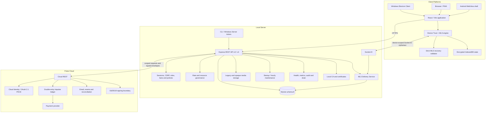

# Архитектура Nexora

## 1. Область и статус

Документ описывает `main` версии `3.2.3`:

- Application API: v3;
- Trust/MLS/encrypted-media API: v4;
- Local Server database: SQLite schema 8;
- distribution: Source/PWA prerelease;
- signed production baseline: `3.1.2`;
- independent cryptographic/application-security review: не завершён.

## 2. Компоненты системы

## 3. Authority boundaries

### Client

Client отвечает за:

- UI и локальное interaction state;
- certificate confirmation в поддерживаемых shells;
- offline cache и durable outbox;
- device identity private key;
- private MLS state и private KeyPackages;
- secure-message encryption/decryption;
- secure-attachment encryption/decryption;
- strict validation recovery envelope до persist;
- local preview/playback после integrity verification;
- Trust state wipe после revocation.

### Local Server

Local Server является authority для:

- local authentication и sessions;
- room membership, roles, bans и restrictions;
- room policies и moderation actions;
- Trust public directory и device status;
- MLS group membership, epoch, replay и delivery order;
- ciphertext persistence;
- storage quota, retention, backups и audit;
- resource ceilings и route-specific rate limits;
- scheduled security-state cleanup.

### Pulse Cloud

Pulse Cloud является authority для:

- Cloud Identity;
- email verification и Cloud MFA;
- OAuth 2.1 Authorization Code + PKCE;
- subscriptions, receipts и billing state;
- Impulse ledger;
- provider webhook reconciliation;
- signed production entitlements.

Local Server не создаёт authoritative production entitlements.

## 4. Client bootstrap и connection flow

1. Client нормализует URL и требует HTTPS вне local development.
2. Health probe получает Server ID, API compatibility, certificate и SHA-256 fingerprint.
3. Пользователь сверяет fingerprint по доверенному каналу.
4. Electron создаёт persistent session partition для Server ID.
5. Certificate verifier принимает только ожидаемые host, Server ID и fingerprint.
6. Local Server создаёт secure HttpOnly session и выдаёт CSRF token.
7. После authentication Client получает `/api/bootstrap` до Trust enrollment.
8. Parent layout lifecycle конфигурирует Trust scope `(Server ID, local user ID)` до дочерних passive effects.
9. Encrypted draft read в коротком pre-configuration window возвращает пустое состояние, не скрывая реальные platform/registration failures.
10. Realtime authentication включает active Trust `deviceId`.
11. Потеря membership, active ban, restriction или device trust немедленно влияет на REST и realtime access.

Такой порядок устраняет циклическую зависимость bootstrap ↔ Trust enrollment ↔ Socket.IO и renderer crash `TRUST_NOT_CONFIGURED`.

## 5. Data model

### Schema 7 baseline

Schema 7 содержит:

- users, sessions, contacts и profiles;
- rooms, membership, roles, bans и invitations;
- messages, reactions, polls, drafts и scheduled operations;
- events, notifications, reports, appeals и audit;
- files, uploads, quota и retention metadata;
- bots, tokens, webhooks и integrations;
- Cloud account links, Pulse keys, entitlement cache и event state;
- checkout/transaction cache и room product state.

### Schema 8 additions

Schema 8 добавляет:

- Trust challenges;
- device records и verification/revocation history;
- MLS KeyPackages;
- groups и group members;
- Welcome queue;
- commit log;
- replay cache;
- Trust audit;
- secure-message и opaque-attachment delivery state;
- persisted security/rate-limit state used by maintenance.

Migration `7 → 8` выполняется до network listen: source integrity, free-space check, WAL checkpoint, verified backup, transactional/idempotent migration, destination integrity и downgrade protection.

Patch updates `3.2.0–3.2.2 → 3.2.3` schema не меняют.

## 6. Authorization model

Mutating browser requests требуют:

- authenticated session;
- допустимый Origin;
- valid CSRF token;
- существующий resource;
- membership, где требуется;
- role/permission;
- ban/restriction check;
- room-policy check;
- input/scope validation;
- route rate limit;
- resource ceiling.

Active ban имеет приоритет над stale membership. Conversation access завершается fail-closed при inconsistent state.

Trust mutations дополнительно требуют `X-Nexora-Device-ID`, active verified device и, где применимо, scoped one-time challenge и valid signature.

## 7. Rate limiting и resource governance

`server/rate-limit.cjs` предоставляет shared memory-bounded sliding-window limiter для Trust, recovery и E2EE attachment routes.

Контракт:

- operation-specific windows и limits;
- bounded bucket count;
- HTTP `429`;
- stable code `RATE_LIMITED`;
- `Retry-After`;
- stale bucket cleanup при startup/hourly maintenance.

Resource ceilings:

- 16 active Trust devices на user;
- 25 KeyPackages в одном request;
- 32 unclaimed KeyPackages на device;
- 256 unclaimed KeyPackages на user.

Limits применяются атомарно в SQLite. Duplicate idempotent registration не расходует capacity повторно; revocation освобождает device capacity.

## 8. Device Trust lifecycle

1. Client создаёт non-extractable Ed25519 identity key.
2. Registration доказывает possession private key.
3. MLS BasicCredential парсится и связывается с authenticated `{ userId, deviceId }`.
4. Identity proof и MLS signature используют разные Ed25519 keys.
5. Первый device получает bootstrap verification.
6. Последующие devices требуют signed approval active verified device.
7. Verification и revocation используют отдельные operation-scoped one-time challenges.
8. Revocation немедленно отключает целевой secure socket.
9. Revoked Client удаляет identity, private MLS state, KeyPackages, cache и drafts до reenrollment.

Local Server хранит public keys, credential, fingerprint, verification state и primitive audit metadata. Private identity key не хранится.

## 9. KeyPackage lifecycle

- verified device публикует one-time KeyPackages;
- upload batch и inventory ограничены resource ceilings;
- target package claim атомарный;
- package scope включает user/device/conversation context;
- expired packages очищаются maintenance process;
- reuse и scope substitution отклоняются.

## 10. MLS secure-message lifecycle

Fixed profile: `MLS_128_DHKEMX25519_AES128GCM_SHA256_Ed25519`.

1. Verified devices публикуют KeyPackages.
2. Group creator атомарно claims target package.
3. Add commit увеличивает epoch ровно на один.
4. Welcome scope-bound к user, device и conversation.
5. Recipient joins и удаляет использованный private package.
6. Composer создаёт MLS application ciphertext до durable outbox enqueue.
7. Server валидирует session, device, membership, ban, group, epoch и replay.
8. Ciphertext сохраняется и доставляется только active verified member devices.
9. Recipient проверяет authenticated data и decrypts локально.
10. Offline recovery требует непрерывную и криптографически проверенную commit chain.

Credential authentication не использует accept-all policy.

## 11. Strict missed-commit recovery

`client/src/crypto/mls-recovery.mjs` проверяет до persist:

- complete group envelope;
- conversation/group scope;
- exact start/end epoch;
- непрерывную последовательность epoch;
- SHA-256 каждого commit payload;
- отсутствие duplicate commit hashes;
- intermediate public-state hashes;
- final public-state hash.

Mismatch, duplicate или gap является hard failure. Server log continuity дополняет, но не заменяет независимую Client verification.

## 12. Encrypted client storage

Trust/MLS state хранится в IndexedDB scope `(Server ID, local user ID)`:

- wrapping key: non-extractable AES-256-GCM CryptoKey;
- identity private key: non-extractable Ed25519 CryptoKey;
- MLS private records: AES-GCM sealed data;
- decrypted cache и drafts: AES-GCM sealed data;
- AAD связывает scope, record key и purpose.

Renderer остаётся частью trusted computing base. Same-origin XSS, malware, dependency compromise или malicious binary могут получить plaintext во время authorized use.

## 13. Ciphertext-only enforcement

После MLS activation Local Server отклоняет plaintext creation через:

- legacy Socket.IO send/forward;
- legacy edit;
- server drafts;
- scheduled messages;
- polls;
- bot message API;
- multipart/resumable upload;
- другие legacy message creation routes.

Encrypted serializer возвращает MLS envelope и neutral preview без plaintext.

## 14. Encrypted media

Secure conversations используют opaque attachment path:

- random AES-256-GCM key и 96-bit IV;
- AAD binding к conversation, attachment ID и media kind;
- plaintext/ciphertext SHA-256;
- filename, MIME, caption, duration и waveform внутри MLS content;
- generic `application/octet-stream` storage;
- raw ciphertext byte cap до parsing;
- exact `plaintextSize + 16` validation;
- quota по actual stored ciphertext bytes;
- pending object недоступен до atomic message claim;
- 24-hour pending expiry и explicit cancel;
- idempotent retry для matching scope/hash;
- one-time claim и reuse rejection;
- verified local decrypt, preview, playback и download.

При запрете любого room class `files/images/voice` весь opaque media path блокируется fail-closed.

## 15. Realtime и offline

REST используется для bootstrap, history, settings, search, Trust directory, KeyPackage/Welcome, recovery, media и commercial management.

Socket.IO используется для presence, typing, read state, legacy events и secure ciphertext delivery.

- API v3 сохраняет monotonic event sequence и delta/resync;
- API v4 добавляет Trust/MLS/recovery/media operations;
- secure outbox idempotent по client ID;
- replay cache блокирует duplicate ciphertext;
- Service Worker кэширует application shell, но не API/Socket.IO;
- targeted revoke disconnect не затрагивает остальные devices account.

## 16. Pulse boundary

Local Server валидирует:

- HTTPS Cloud origin;
- scoped service credential;
- request ID, timestamp, nonce и idempotency;
- Ed25519 envelope/entitlement signatures;
- server, user, room, product и expiry scope;
- replay state.

Pulse Cloud не получает local messages, room history, local files, local password/session cookie, Trust private keys или Local CA private key.

Local Server не получает card data, Cloud password/MFA secret, signing private key или OAuth refresh token.

## 17. Operational runtime и maintenance

Local Server и Pulse Cloud предоставляют:

- liveness/readiness;
- protected Prometheus metrics;
- request IDs;
- recursive credential redaction;
- graceful drain/shutdown;
- audited allowlisted commands без shell/eval.

Local Server startup/hourly maintenance удаляет:

- expired sessions;
- login history старше 90 дней;
- stale persisted rate-limit buckets;
- expired Trust/KeyPackage state;
- существующие orphan/pending resources по retention policy.

Server shutdown сериализует concurrent stop/quit, отсоединяет active instance до close и формирует stopped-state Pulse/Trust snapshots без чтения закрытого SQLite handle.

## 18. Security и privacy limitations

Nexora `3.2.3` не скрывает:

- membership;
- account/device identifiers;
- timing и network context;
- ciphertext size;
- uploader identity;
- attachment ID;
- delivery order и traffic pattern.

Не заявляются independent audit, traffic-analysis resistance или seamless recovery после total private-state loss.

## 19. Compatibility

- current repository version: `3.2.3`;
- signed production baseline: `3.1.2`;
- Application API: v3;
- Trust/MLS/encrypted-media API: v4;
- Local Server database: schema 8;
- database migration с 3.2.0–3.2.2 не требуется;
- 3.1.x clients не поддерживают active secure 3.2.x conversations;
- existing 3.1.x content не шифруется ретроактивно.
