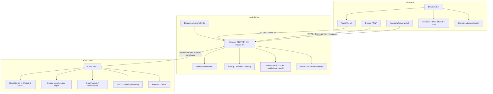

# Архитектура Nexora 3.1.2

## Компоненты

## Поток подключения к Local Server

1. Client нормализует URL и принимает только HTTPS localhost/LAN/Radmin/public-domain address.
2. Health probe получает Server ID, API compatibility, PEM certificate и SHA-256 fingerprint.
3. Для нового сервера пользователь сверяет fingerprint по доверенному каналу.
4. Electron создаёт отдельную persistent session для каждого Server ID; certificate verifier разрешает только совпавшие host/Server ID/fingerprint.
5. Renderer загружает web client, а API создаёт secure HttpOnly session и выдаёт CSRF token.
6. После потери membership/доступа Server прекращает room events и отклоняет последующие REST/Socket.IO операции.

## Local Server data model

`server/store.cjs` и schema 7 integration используют SQLite, WAL и `synchronous=FULL`. Изменения сериализуются, выполняются в транзакциях и фиксируются только после серверной авторизации, role/membership/ban checks и валидации.

Schema 7 включает:

- базовые users, sessions, rooms, messages, files, reactions, notifications и audit;
- v3 events, drafts, scheduled messages, polls, edit history, invites, reports, appeals, roles, categories, bots и webhooks;
- Cloud account links и одноразовые link sessions;
- pinned Pulse signing keys, verified entitlement cache и sync cursor;
- event inbox/outbox, checkout/transaction cache и room product state.

Перед schema 6 → 7 выполняются integrity и free-space checks, создаётся проверенный backup, затем миграция проходит до открытия network traffic. Schema downgrade блокируется при обычной записи и restore.

FTS5 индексируется triggers на messages. Вложения лежат отдельно и связываются метаданными; message и attachment metadata фиксируются транзакционно. Maintenance отвечает за backup/restore, expiry, quota и orphan cleanup.

## Realtime и offline

REST используется для bootstrap, history, search, upload, settings и commercial management; Socket.IO — для messages, typing, presence, delivery/read, room events и scoped Pulse updates.

API v3 выдаёт монотонную event sequence и delta/resync. Текстовые сообщения имеют client ID и durable outbox. Resumable upload использует upload ID, chunk index и SHA-256. Cloud event sync использует отдельный cursor, replay protection и проверку signed authoritative scope до изменения local cache.

PWA Service Worker кэширует только application shell; API и Socket.IO исключены. Авторизованные bootstrap/messages хранятся отдельно в IndexedDB. Android использует тот же HTTPS web client, ограничивает навигацию origin сервера и всегда отменяет TLS error.

## Pulse trust boundary

Local Server отправляет в Cloud только данные, необходимые конкретной Cloud Identity или billing-операции. Production entitlement и authoritative ledger state создаются только Pulse Cloud.

Local Server проверяет:

- HTTPS Cloud origin и scoped service credential;
- request ID, timestamp, nonce и idempotency scope;
- Ed25519 key ID, envelope signature и nested entitlement signature;
- server/user/room/product scope, activation time и expiry;
- replay и payload substitution.

Pulse Cloud не получает local messages, files, room history, local password, local session cookie или local CA private key. Local Server не получает card data, Cloud password, MFA secret, signing private key или OAuth refresh token.

## Operational runtime

Local Server и Pulse Cloud публикуют:

- `/healthz/live` — процесс жив;
- `/healthz/ready` — dependencies готовы и процесс не находится в drain mode;
- `/metrics` — Prometheus text format, доступный по bearer token или только loopback.

Operational middleware назначает request ID и рекурсивно скрывает credentials из логов. Graceful shutdown сначала переводит readiness в `503`, затем останавливает workers, HTTP/Socket.IO и SQLite. CLI и Windows Server Admin используют фиксированный audited command registry без shell/eval.

## Trust boundaries

- Client renderer не имеет Node integration.
- Desktop shell отвечает за certificate trust, isolated server sessions и signed updates.
- Local Server является authority локального контента, roles, membership и files.
- Pulse Cloud является authority Cloud Identity, money, ledger и production entitlements.
- Bot API ограничен scopes и room membership.
- Outgoing webhook разрешён только на публичный HTTPS endpoint после DNS/IP validation и подписывается HMAC.
- GitHub Release является update source Client только после code signing и полной публикации updater assets.

## Совместимость и границы

Server сообщает API version 3 и принимает основной диапазон Client major 2–3. Nexora 3.1.2 использует schema 7 и 3.1 Cloud capabilities, сохраняя основной messaging protocol 3.x. Несовместимый Client получает HTTP 426.

Stable 3.1.2 не использует E2EE. Экспериментальные Trust Core/MLS ветки 3.2.0 являются отдельной разработкой и не меняют security properties `main` до завершения interoperability, plaintext-bypass, migration, UI и release gates.
