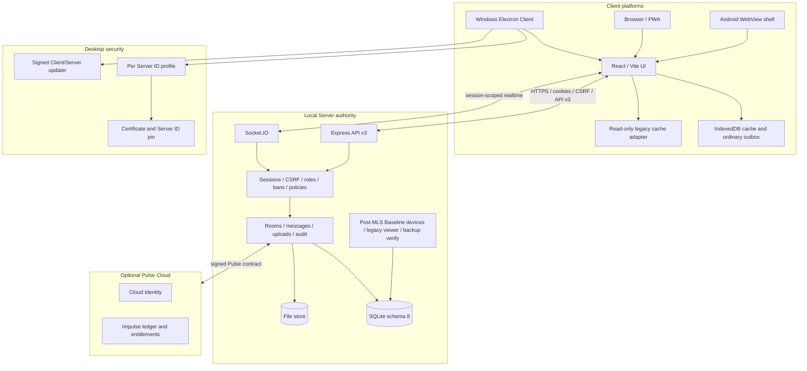

# Архитектура Nexora 3.3.4 Post-MLS Baseline

## Scope and status

This document describes release candidate branch `release/3.3.4-stable-core` and PR #69. It does not claim that `v3.3.4` is published.

- Application API: v3;
- writable messaging core: ordinary server-readable conversations;
- legacy Trust/MLS runtime: removed;
- legacy data: schema 8 compatibility tables plus immutable ciphertext history;
- signed production baseline: `3.1.2`;
- stable publication: blocked pending verified `v3.3.4`, signing/Windows acceptance and independent review.

## System view



## Authority split

### Client

The client owns rendering, input, local interaction state, offline cache, media lifecycle and platform capability reporting. Client-side disabled/hidden controls are not authorization.

### Local Server

The server owns authentication, device/session scope, Origin/CSRF, membership, roles, bans, room policy, validation, resource limits, durable mutations, audit and realtime visibility. Every direct API/Socket.IO path applies these checks before side effects.

### Pulse Cloud

Pulse Cloud remains a separate authority for Cloud Identity, production ledger and signed entitlements. The Local Server does not become a payment authority.

## Writable messaging core

Ordinary conversations use `server/create-server.cjs`, `server/v3-features.cjs`, `server/model.cjs`, `server/store.cjs` and `server/events.cjs`.

- messages are stored by Local Server;
- uploads are validated for actual size/type and safe paths;
- ordinary outbox items validate current access after reconnect and use bounded retry;
- event delivery is duplicate-tolerant and scoped to current access;
- revoked sessions are disconnected immediately.

## Legacy Trust/MLS retirement

Executable Trust Core, recovery routes, MLS transport, encrypted-upload writes and client MLS engine are not packaged or mounted. `ts-mls` is removed from dependencies.

Schema 8 is retained because destructive removal would violate data integrity. The compatibility boundary preserves group/message IDs, epochs, timestamps, ciphertext hashes and audit provenance.

### Read-only flow

1. Bootstrap marks a conversation `legacySecure` when schema 8 contains an MLS group.
2. Workspace routes it to `LegacySecureHistoryPane` rather than `MessagePane`.
3. Server exposes immutable ciphertext metadata through `/api/v3/legacy-secure/*`.
4. The optional local adapter reads pre-existing decrypted IndexedDB records using readonly transactions; it never generates keys or writes records.
5. Export combines server ciphertext evidence with locally available content on the client. `serverDecrypted` remains `false`.
6. Every legacy HTTP mutation returns `410/LEGACY_READ_ONLY`; MLS Socket.IO mutations are rejected with the same code.

No legacy ciphertext is converted into server plaintext.

## Sessions and devices

Sessions are authoritative device records with `deviceId`, name, platform, client version, `createdAt`, `lastSeenAt` and expiry.

- `GET /api/v3/devices` groups active sessions by device;
- revoke removes sessions transactionally from the store;
- `session.revoked` is emitted to target session rooms;
- target sockets are disconnected via `disconnectSockets(true)`;
- `device.updated` refreshes the account inventory;
- current-device revoke returns `STATE_CONFLICT` and directs the user to logout.

Electron isolates cookies, IndexedDB, cache and pin state by Server ID. Certificate/identity change requires explicit confirmation; silent repin remains prohibited.

## Storage, migration and restore

Startup order is:

1. open database;
2. integrity check and WAL checkpoint;
3. read schema version and reject future schema;
4. check free space;
5. create and verify backup;
6. execute transactional/idempotent migration;
7. initialize services;
8. listen on network.

Backup verification materializes encrypted data only in a temporary directory and removes it after success/failure. Restore stages database and file store separately, validates both, swaps them under lock and rolls back both on failure. Database replacement keeps a rollback copy until the new database passes integrity.

## Error and idempotency model

REST errors use:

```json
{
  "ok": false,
  "code": "STATE_CONFLICT",
  "message": "Safe user-facing message",
  "requestId": "correlation-id",
  "details": {}
}
```

The response also preserves `error` for backward compatibility. Logs include correlation IDs and recursively redact credentials/secrets. Retryable client operations use bounded exponential backoff, `Retry-After`, terminal code classification and stable client IDs/Idempotency-Key where the existing contract supports it.

## Updater and release architecture

Client uses `latest` metadata; Server uses `server` metadata. Both require Windows signature verification. The updater rejects prerelease/downgrade states, invalid signatures/checksums and non-HTTPS custom feeds.

The release workflow:

1. confirms a published verified `v3.3.4` baseline;
2. requires complete signing credentials plus expected certificate subject/thumbprint;
3. runs release gates;
4. builds source/PWA/SPDX/Android evidence;
5. builds signed Client and Server assets with complete metadata;
6. verifies Authenticode and timestamp;
7. performs n-1→n installed smoke;
8. creates checksums/evidence and an immutable annotated tag;
9. publishes the release;
10. re-downloads and verifies every asset.

Without signing policy, only a distinct `-unsigned-test.<run>` prerelease is allowed and updater metadata is forbidden.

## Realtime visibility

Connections join session/user/conversation scopes only after authentication and current access validation. Membership/session loss removes realtime access. Post-MLS Baseline events are:

- `session.revoked`;
- `device.updated`;
- `legacy_secure_history.state`;
- updater state is exposed in desktop shell IPC/state.

## Residual constraints

- schema 8 retains historical Trust/MLS tables by design;
- locally decrypted legacy content exists only if a previous client already cached it;
- signed Windows acceptance requires external credentials and Windows environments;
- current branch cannot be a stable release without a verified 3.3.4 baseline and independent review closure.
