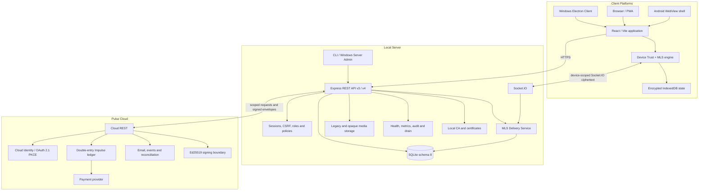

# Nexora Architecture

## 1. Scope and release status

This document describes the architecture present on `main` at version `3.2.0`.

- application API: v3;
- Trust/MLS API: v4;
- Local Server database: SQLite schema 8;
- release classification: Source/PWA prerelease;
- signed production baseline: 3.1.2;
- independent cryptographic/application-security review: not completed.

## 2. System components

## 3. Authority boundaries

### Client

The Client is responsible for:

- user interface and local interaction state;
- certificate confirmation in supported shells;
- offline cache and durable outbox;
- device identity private key;
- private MLS state and KeyPackages;
- secure-message encryption/decryption;
- secure-attachment encryption/decryption;
- local preview and playback after verification.

### Local Server

Local Server is authoritative for:

- local authentication and sessions;
- room membership, roles, bans and restrictions;
- room policy and moderation actions;
- message ordering and realtime access;
- Trust public directory and device status;
- MLS group membership, epoch and replay state;
- ciphertext persistence and delivery;
- storage quota, retention, backups and audit.

### Pulse Cloud

Pulse Cloud is authoritative for:

- Cloud Identity;
- email verification and Cloud MFA;
- OAuth 2.1 Authorization Code + PKCE;
- subscriptions, receipts and billing state;
- Impulse ledger;
- provider webhook reconciliation;
- signed production entitlements.

Local Server is not permitted to create authoritative production entitlements.

## 4. Connection flow

1. Client normalizes the URL and requires HTTPS for non-development access.
2. Health probe obtains Server ID, API compatibility, certificate and SHA-256 fingerprint.
3. User verifies the fingerprint through a trusted channel.
4. Electron creates a persistent session partition for the Server ID.
5. The certificate verifier accepts only the expected host, Server ID and fingerprint.
6. Local Server creates a secure HttpOnly session and issues a CSRF token.
7. Client configures local Trust scope using `(Server ID, local user ID)`.
8. Realtime authentication includes the active Trust `deviceId` for secure delivery.
9. Loss of membership, ban, restriction or device trust immediately affects REST and realtime access.

## 5. Data model

### Schema 7 baseline

Schema 7 contains:

- users, sessions, contacts and profiles;
- rooms, membership, roles, bans and invitations;
- messages, reactions, polls, drafts and scheduled operations;
- events, notifications, reports, appeals and audit;
- files, uploads, storage metadata and retention state;
- bots, tokens, webhooks and integrations;
- Cloud account links, Pulse keys, verified entitlement cache and event state;
- checkout/transaction cache and room product state.

### Schema 8 additions

Schema 8 adds Trust/MLS state, including:

- Trust challenges;
- device records and verification/revocation history;
- MLS KeyPackages;
- groups and group members;
- Welcome queue;
- commit log;
- replay cache;
- Trust audit;
- secure-message and opaque-attachment delivery state.

Migration `7 → 8` runs before network listen and performs source integrity check, free-space validation, WAL checkpoint, verified backup, transactional/idempotent migration, destination integrity check and downgrade protection.

Existing 3.1.x messages and files are not rewritten or retroactively encrypted.

## 6. Authorization model

Mutating browser requests require:

- authenticated session;
- matching Origin;
- valid CSRF token;
- resource existence;
- membership where required;
- role/permission checks;
- ban/restriction checks;
- room-policy checks;
- input validation;
- rate limiting.

Trust mutations additionally require `X-Nexora-Device-ID` and, where applicable, a scoped one-time challenge and valid device signature.

Realtime subscriptions are removed or denied when access changes. Secure ciphertext delivery is device-scoped rather than account-wide.

## 7. Device Trust lifecycle

1. Client creates a non-extractable Ed25519 identity key.
2. Registration proves possession of the private key.
3. The first device receives bootstrap verification.
4. Additional devices require signed approval from an active verified device.
5. Verification and revocation use separate one-time scoped challenges.
6. Revocation immediately disconnects the target secure socket.
7. The revoked Client wipes device identity, private MLS state, KeyPackages, decrypted cache and drafts before reenrollment.

Local Server stores public identity/signature keys, credential, fingerprint, verification state and audit metadata. It does not store the private identity key.

## 8. MLS secure-message lifecycle

Fixed profile: `MLS_128_DHKEMX25519_AES128GCM_SHA256_Ed25519`.

1. Verified devices publish one-time KeyPackages.
2. Group creator atomically claims the target KeyPackage.
3. Add commit advances the epoch by exactly one.
4. Welcome is scoped to user, device and conversation.
5. Recipient joins and removes the consumed private KeyPackage.
6. Composer creates MLS application ciphertext before durable outbox enqueue.
7. Local Server validates session, device, membership, group, epoch and replay state.
8. Server persists ciphertext and emits it only to active verified member devices.
9. Recipient verifies authenticated data and decrypts locally.
10. Offline recovery requires a contiguous commit chain; unrecoverable state loss fails explicitly.

Credential authentication does not use an accept-all policy.

## 9. Encrypted client storage

Trust/MLS state is scoped by `(Server ID, local user ID)` in IndexedDB.

- wrapping key: non-extractable AES-256-GCM CryptoKey;
- identity private key: non-extractable Ed25519 CryptoKey;
- MLS private records: AES-GCM sealed data;
- decrypted cache and drafts: AES-GCM sealed data;
- AAD binds scope, record key and purpose.

The renderer remains part of the trusted computing base. XSS, malware, dependency compromise or a malicious application binary can access plaintext during authorized use.

## 10. Ciphertext-only enforcement

After an MLS group becomes active, Local Server rejects plaintext creation through:

- legacy Socket.IO send and forward;
- legacy edit;
- server drafts;
- scheduled messages;
- polls;
- bot message API;
- multipart and resumable upload paths;
- other legacy message creation routes.

Encrypted message serialization exposes an MLS envelope and a neutral preview rather than plaintext.

## 11. Encrypted media

Secure conversations use an opaque attachment path:

- random AES-256-GCM key and 96-bit IV per payload;
- AAD binding to conversation, attachment ID and media kind;
- plaintext and ciphertext SHA-256 verification;
- original filename, MIME, caption, duration and waveform inside MLS content;
- generic `application/octet-stream` server storage;
- exact GCM-size and ciphertext-hash validation;
- pending attachment unavailable before atomic message claim;
- 24-hour pending expiry and explicit cancel;
- idempotent retry for matching scope/hash;
- one-time claim and reuse rejection;
- verified local decrypt, image preview, voice playback and download.

When any room file/image/voice class is disabled, the complete opaque secure-media path fails closed because Local Server cannot inspect encrypted content safely.

## 12. Realtime and offline

REST is used for bootstrap, history, settings, search, Trust directory, KeyPackage/Welcome, commit recovery, media and commercial management.

Socket.IO is used for presence, typing, read state, legacy events and secure ciphertext delivery.

- API v3 retains monotonic event sequence and delta/resync;
- Trust API v4 adds device/group/recovery operations;
- secure outbox is idempotent by client ID;
- replay cache rejects duplicate ciphertext;
- Service Worker caches application shell only;
- API and Socket.IO responses are not served from Service Worker cache.

## 13. Pulse boundary

Local Server validates:

- HTTPS Cloud origin;
- scoped service credential;
- request ID, timestamp, nonce and idempotency;
- Ed25519 envelope and entitlement signatures;
- server, user, room, product and expiry scope;
- replay state.

Pulse Cloud does not receive local messages, room history, local files, local password/session cookie, Trust private keys or Local CA private key.

Local Server does not receive card data, Cloud password/MFA secret, signing private key or OAuth refresh token.

## 14. Operational runtime

Local Server and Pulse Cloud provide:

- liveness;
- readiness;
- protected Prometheus metrics;
- request IDs;
- recursive credential redaction;
- graceful drain and shutdown;
- audited allowlisted developer commands without shell/eval.

## 15. Security and privacy limitations

Nexora 3.2.0 does not hide:

- membership;
- account/device identifiers;
- timing and network context;
- ciphertext size;
- uploader identity;
- attachment ID;
- delivery order and traffic pattern.

The release does not claim independent audit, traffic-analysis resistance or seamless recovery after total private-state loss.

## 16. Compatibility

- current repository version: `3.2.0`;
- signed production baseline: `3.1.2`;
- application API: v3;
- Trust/MLS API: v4;
- Local Server database: schema 8;
- 3.1.x clients do not support active secure 3.2.0 conversations;
- existing 3.1.x content is not retroactively encrypted.
