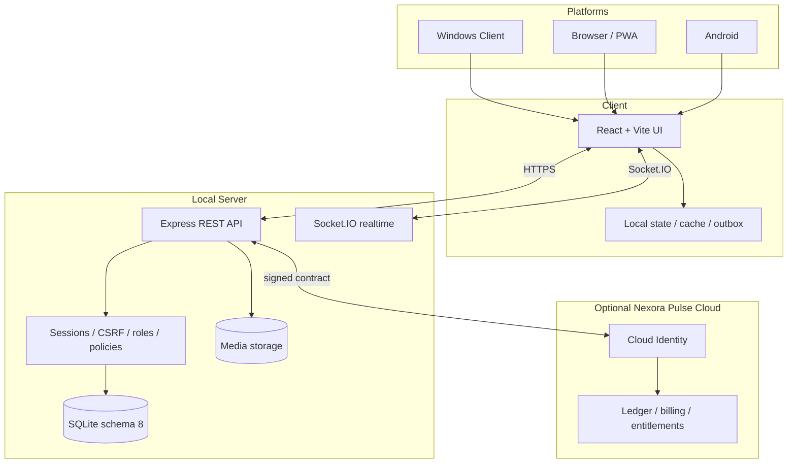

# Architecture

## System map

## Responsibility split

### Client

- rendering, input, loading/error states and local navigation;
- IndexedDB cache, drafts and durable outbox;
- media preview/playback and platform permission UX;
- reconnect/retry behavior that tolerates duplicate delivery.

### Local Server

- authentication, authorization, roles and room policies;
- validation, rate limits, quotas and business invariants;
- persistence, migrations, audit records and system messages;
- file/MIME/size/hash checks and lifecycle cleanup;
- realtime access checks and revocation after removal or ban.

### Pulse Cloud

- optional Cloud Identity, Plus and Impulse ledger;
- server-defined pricing and signed entitlements;
- no authority over Local Server rooms or ordinary local messaging;
- local-only operation remains a supported product boundary.

## Current data boundary

Current `main` is `3.3.3` with Application API v3, Trust/MLS API v4 and SQLite schema 8. The approved `3.3.4` direction removes executable Trust/MLS runtime, restores ordinary server-readable writes and preserves legacy ciphertext only as read-only history/export.

## Core invariants

- every room has exactly one owner;
- server-side permission checks are authoritative;
- bans remove REST and realtime access;
- invite consumption and membership creation are atomic;
- retry-sensitive mutations are idempotent;
- uploaded content is validated independently of client metadata;
- release claims require matching source, version, tag, evidence and assets.

## Source references

- [`docs/ARCHITECTURE.md`](../ARCHITECTURE.md)
- [`PROJECT_INDEX.md`](../../PROJECT_INDEX.md)
- [`docs/SECURITY_MODEL.md`](../SECURITY_MODEL.md)
- [`docs/ADR_0001_PULSE_CLOUD_BOUNDARY.md`](../ADR_0001_PULSE_CLOUD_BOUNDARY.md)