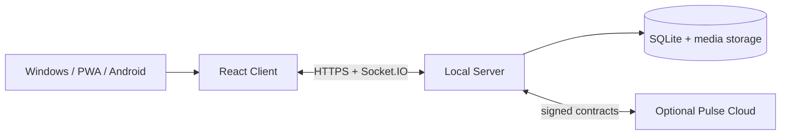

# Nexora Wiki

**Nexora** — self-hosted messaging platform for Windows, Browser/PWA and Android. The system combines a Local Server, multi-platform client, rooms and moderation, offline synchronization, media, operational tooling and the optional Nexora Pulse commercial boundary.

> This Wiki is a concise navigation layer. Authoritative product and release documentation remains in the repository. Current behavior is defined only by `main`; development branches and planned roadmap items are not product guarantees.

## Current status

| Property | Value |
|---|---|
| Current repository version | `3.3.3` |
| Distribution | Published `UNSIGNED-TEST` prerelease |
| Signed production baseline | `3.1.2` |
| Application API | v3 |
| Trust/MLS API | v4 on current `main`; planned retirement in 3.3.4 |
| Local Server database | SQLite schema 8 |
| Active prerequisite | `3.3.4 Post-MLS Baseline` |

## Start here

| Goal | Page / document |
|---|---|
| Install or run locally | [Getting Started](Getting-Started) |
| Understand system boundaries | [Architecture](Architecture) |
| Review security assumptions | [Security and Privacy](Security-and-Privacy) |
| Contribute code | [Development and Testing](Development-and-Testing) |
| Track releases | [Releases and Roadmap](Releases-and-Roadmap) |
| Operate a server | [Operations and Support](Operations-and-Support) |
| Read full documentation | [`docs/README.md`](../README.md) |

## Product capabilities

- personal dialogs, Saved Messages and rooms;
- replies, threads, reactions, mentions, polls and scheduled send;
- owner/moderator/member administration, bans, invitations and audit log;
- files, images and voice messages with validation and progress states;
- IndexedDB cache, delta synchronization and durable outbox;
- Windows Client/Server shells, Browser/PWA and Android shell;
- optional Pulse/Cloud Identity boundary with server-owned pricing and entitlements.

## Architecture at a glance

## Active planning

The roadmap is sequential: `3.3.4 → 3.4.0 → 3.5.0 → 3.6.0 → 3.7.0 → 3.8.0 → 3.9.0 → 3.10.0 → 3.11.0 → 4.0.0`.

- Portfolio index: [`PROJECTS.md`](../../PROJECTS.md)
- Central tracking issue: [#84](https://github.com/Onmaynec/Nexora/issues/84)
- Authoritative roadmap: [`../ROADMAP.md`](../../../ROADMAP.md)

## Documentation rules

1. Separate implemented, automated-verified, manual-verified and planned scope.
2. Do not present unsigned prerelease assets as stable production builds.
3. Never publish secrets, private keys, databases, backups, tokens or real user content.
4. Preserve release and branch provenance.
5. Link every behavior change to tests, release notes and verification evidence.