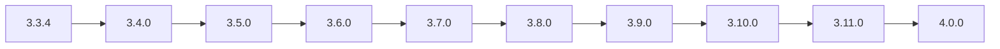

# Releases and Roadmap

## Current release state

| Line | Classification |
|---|---|
| `3.3.3` | Published `UNSIGNED-TEST` prerelease |
| `3.1.2` | Last documented signed production baseline |
| `3.3.4` | Active post-MLS prerequisite, not yet current product |
| `3.4.0+` | Planned sequential roadmap |

## Active work

- [#74 — Nexora 3.3.4 Post-MLS Baseline](https://github.com/Onmaynec/Nexora/issues/74)
- [PR #70 — primary 3.3.4 candidate](https://github.com/Onmaynec/Nexora/pull/70)
- [#75 — Nexora 3.4.0 Stable Core](https://github.com/Onmaynec/Nexora/issues/75)
- [PR #69 — draft 3.4.0 implementation](https://github.com/Onmaynec/Nexora/pull/69)
- [#84 — central Release Portfolio](https://github.com/Onmaynec/Nexora/issues/84)

## Release sequence

| Version | Working name | Epic |
|---|---|---:|
| `3.3.4` | Post-MLS Baseline | [#74](https://github.com/Onmaynec/Nexora/issues/74) |
| `3.4.0` | Stable Core | [#75](https://github.com/Onmaynec/Nexora/issues/75) |
| `3.5.0` | Mobile Continuity | [#76](https://github.com/Onmaynec/Nexora/issues/76) |
| `3.6.0` | Connect | [#77](https://github.com/Onmaynec/Nexora/issues/77) |
| `3.7.0` | Communities | [#78](https://github.com/Onmaynec/Nexora/issues/78) |
| `3.8.0` | Workspaces | [#79](https://github.com/Onmaynec/Nexora/issues/79) |
| `3.9.0` | Ecosystem | [#80](https://github.com/Onmaynec/Nexora/issues/80) |
| `3.10.0` | Cloud Services | [#81](https://github.com/Onmaynec/Nexora/issues/81) |
| `3.11.0` | Organizations | [#82](https://github.com/Onmaynec/Nexora/issues/82) |
| `4.0.0` | Nexora Platform | [#83](https://github.com/Onmaynec/Nexora/issues/83) |

## Release governance

A release is not complete until:

- source and version metadata agree;
- required migrations and compatibility checks pass;
- authorization, security and regression tests pass;
- platform acceptance is complete;
- documentation, changelog and verification are updated;
- the PR is merged into `main`;
- immutable tag and GitHub Release are published;
- release assets are downloaded again and smoke-verified.

A later release must not begin before the previous release is actually published with complete evidence.

## Authoritative sources

- [`ROADMAP.md`](../../ROADMAP.md)
- [`PROJECTS.md`](../../PROJECTS.md)
- [`CHANGELOG.md`](../../CHANGELOG.md)
- [`docs/releases/`](../releases/)
- [`BRANCHES.md`](../../BRANCHES.md)